# SOLWEIG 2022a — Execution Flow & Formula Reference

> **Scope:** Full technical trace from QGIS plugin entry point through every computational stage to the final Tmrt raster.  
> **Version tag:** `Solweig_2022a_calc` (active as of commit `e0c3d5a`).  
> **Key files:** `SOLWEIG/solweig.py`, `SOLWEIG/solweigworker.py`, `SOLWEIG/SOLWEIGpython/Solweig_2022a_calc.py` and helper modules.

---

## Table of Contents

1. [Execution Flow — Ordered Steps](#1-execution-flow--ordered-steps)
2. [Full Pipeline Flowchart (Mermaid)](#2-full-pipeline-flowchart-mermaid)
3. [Formulas Along the Execution Path](#3-formulas-along-the-execution-path)
   - [F-1 Solar geometry and declination](#f-1-solar-geometry-and-declination)
   - [F-2 Vapor pressure](#f-2-vapor-pressure)
   - [F-3 Atmospheric (sky) emissivity — Prata 1996](#f-3-atmospheric-sky-emissivity--prata-1996)
   - [F-4 Clear-sky direct normal irradiance and clearness index](#f-4-clear-sky-direct-normal-irradiance-and-clearness-index)
   - [F-5 Diffuse / direct shortwave splitting — Reindl et al. 1990](#f-5-diffuse--direct-shortwave-splitting--reindl-et-al-1990)
   - [F-6 Surface temperature diurnal wave](#f-6-surface-temperature-diurnal-wave)
   - [F-7 Cloud correction for surface temperature](#f-7-cloud-correction-for-surface-temperature)
   - [F-8 Vegetation shadow attenuation](#f-8-vegetation-shadow-attenuation)
   - [F-9 Anisotropic diffuse irradiance — Perez et al. 1993](#f-9-anisotropic-diffuse-irradiance--perez-et-al-1993)
   - [F-10 Cylindric wedge — F_sh (wall shadow fraction)](#f-10-cylindric-wedge--f_sh-wall-shadow-fraction)
   - [F-11 Ground View Factor upwelling longwave (Lup component per direction)](#f-11-ground-view-factor-upwelling-longwave-lup-component-per-direction)
   - [F-12 GVF directional averaging and background air term](#f-12-gvf-directional-averaging-and-background-air-term)
   - [F-13 Surface temperature wave-delay smoothing](#f-13-surface-temperature-wave-delay-smoothing)
   - [F-14 Downward shortwave on horizontal plane (Kdown)](#f-14-downward-shortwave-on-horizontal-plane-kdown)
   - [F-15 Upward shortwave (Kup) from ground and walls](#f-15-upward-shortwave-kup-from-ground-and-walls)
   - [F-16 Shortwave on vertical cylinder sides (KsideI / Kside)](#f-16-shortwave-on-vertical-cylinder-sides-ksidei--kside)
   - [F-17 Shortwave on box cardinal faces (Keast/Ksouth/Kwest/Knorth)](#f-17-shortwave-on-box-cardinal-faces-keastkouth-kwestknorth)
   - [F-18 SVF-weighted wall-height angle](#f-18-svf-weighted-wall-height-angle)
   - [F-19 Isotropic downward longwave (Ldown) — Jonsson et al. 2006](#f-19-isotropic-downward-longwave-ldown--jonsson-et-al-2006)
   - [F-20 Cloudy-sky correction for isotropic Ldown](#f-20-cloudy-sky-correction-for-isotropic-ldown)
   - [F-21 Anisotropic sky emissivity per patch — Martin & Berdahl 1984](#f-21-anisotropic-sky-emissivity-per-patch--martin--berdahl-1984)
   - [F-22 Anisotropic Ldown and Lside on cylinder (Lcyl_v2022a)](#f-22-anisotropic-ldown-and-lside-on-cylinder-lcyl_v2022a)
   - [F-23 Longwave from cardinal-direction walls (Lside_veg_v2022a)](#f-23-longwave-from-cardinal-direction-walls-lside_veg_v2022a)
   - [F-24 Nighttime upwelling longwave](#f-24-nighttime-upwelling-longwave)
   - [F-25 Mean Radiant Temperature (Tmrt)](#f-25-mean-radiant-temperature-tmrt)
   - [F-26 Wind speed height correction (PET and UTCI)](#f-26-wind-speed-height-correction-pet-and-utci)
4. [Ambiguities / Needs Verification](#4-ambiguities--needs-verification)

---

## 1. Execution Flow — Ordered Steps

| # | Module / Function | Purpose | Key Inputs | Key Outputs |
|---|---|---|---|---|
| 1 | **`solweig.py` → `SOLWEIG.__init__`** | Plugin is registered with QGIS. UI is wired. | QGIS plugin API | Plugin object, menu entry |
| 2 | **`solweig.py` → `SOLWEIG.run`** | Dialog opens. Combo-boxes for rasters are populated from QGIS layer registry. | QGIS layers, previously saved settings | Populated `SOLWEIGDialog` |
| 3 | **`solweig.py` → `SOLWEIG.start_progress`** | User clicks Run. All inputs are validated and spatial rasters are loaded via GDAL into numpy arrays. | DSM, DEM, vegDSM×2, wall height, wall aspect, SVF zip, LC raster, met file path, POI vector layer | `dsm`, `dem`, `vegdsm`, `svf*` (19 arrays), `lcgrid`, `walls`, `dirwalls`, `metdata` (n×24 array) |
| 4 | **`Solweig_v2015_metdata_noload.py` → `Solweig_2015a_metdata_noload`** | Parses the met file; calls `sun_position` for every timestep (+ daily 15-min scan for `altmax`). | `metdata` array, `location` dict, UTC offset | `altitude[1,n]`, `azimuth[1,n]`, `zen[1,n]` (rad), `jday[1,n]`, `dectime[n]`, `altmax[1,n]`, `leafon[1,n]` |
| 5 | **`solweig.py` → derived grids** | Builds `buildings` mask (DSM−DEM or LC), `svfbuveg` (effective sky fraction with vegetation transmissivity), `svfalfa` (SVF-weighted building-height angle), `psi` (vegetation transmissivity vector per timestep). | `svf`, `svfveg`, `leafon`, UI transmissivity controls | `buildings`, `svfbuveg`, `svfalfa`, `psi[1,n]` |
| 6 | **`Tgmaps_v1.py` → `Tgmaps_v1`** | Maps LC class table columns to per-pixel grids. | `lc_grid`, `lc_class` (from `landcoverclasses_2016a.txt`) | `TgK`, `Tstart`, `alb_grid`, `emis_grid`, `TmaxLST`, `TgK_wall`, `Tstart_wall`, `TmaxLST_wall` |
| 7 | **`WriteMetadataSOLWEIG.py` → `writeRunInfo`** | Writes `RunInfoSOLWEIG_*.txt` with all run parameters. | Run configuration | Metadata text file |
| 8 | **`solweigworker.py` → `Worker.__init__`** | Worker object is constructed with ~80 parameters; `QThread.start()` is called. | All of the above | `Worker` object |
| 9 | **`solweigworker.py` → `Worker.run` — time loop** | Iterates `i = 0 … N−1` over all meteorological timesteps. At midnight (dectime mod 1 == 0) refreshes `Twater` and looks ahead for the first sunlit CI value. | `Ta`, `RH`, `radG`, `radD`, `radI`, `P`, `Ws` time series | Per-timestep output arrays passed to step 10 |
| 10 | **`Solweig_2022a_calc.py` → `Solweig_2022a_calc`** (daytime branch) | Full per-timestep radiation physics (see §3 for formulas). | One row of met data + all spatial grids | `Tmrt`, `Kdown`, `Kup`, `Ldown`, `Lup`, `Keast/S/W/N`, `Least/S/W/N`, `shadow`, `Tg`, `esky`, `CI`, … |
| 10N | **`Solweig_2022a_calc.py` → `Solweig_2022a_calc`** (nighttime branch) | All shortwave fluxes = 0; longwave uses nocturnal Stefan–Boltzmann with `Ta+Tg`. | Same as 10 but `altitude ≤ 0` | Same return tuple with K-fluxes = 0 |
| 11 | **`solweigworker.py` → POI writing** | Samples grid arrays at POI pixel locations; computes PET and UTCI; appends 35-column row to `POI_<name>.txt`. | Grid arrays, `poisxy`, `Ws`, person parameters | `POI_*.txt` rows (35 cols) |
| 12 | **`solweigworker.py` → raster writing** | Writes selected GeoTIFFs (`Tmrt`, `Shadow`, `Kdown`, `Kup`, `Ldown`, `Lup`, etc.) for this timestep. | Grid arrays, `gdal_dsm` georef | `Tmrt_YYYY_DOY_HHMMw.tif`, etc. |
| 13 | **`solweig.py` → `finishedWorker`** | Receives average `tmrtplot` from worker; loads it as a temporary QGIS raster layer. | `tmrtplot/N` | QGIS canvas layer |

---

## 2. Full Pipeline Flowchart (Mermaid)

```mermaid
flowchart TD
    U([User clicks Run in QGIS]) --> SP[solweig.py\nstart_progress\nLoad DSM / veg / SVF / LC rasters\nvia GDAL → numpy]

    SP --> ML[Solweig_v2015_metdata_noload\nParse met file\nCompute sun_position for each timestep\nBuilds altitude azimuth zen altmax arrays]

    ML --> DG[Derived grids\nbuildings mask\nsvfbuveg = svf−1−svfveg×1−trans\nsvfalfa from SVF\npsi per timestep]

    DG --> TM[Tgmaps_v1\nMap LC class table\nto TgK Tstart alb_grid\nemis_grid TmaxLST grids]

    TM --> WR[WriteMetadataSOLWEIG\nRunInfoSOLWEIG txt]

    WR --> WK[solweigworker.py Worker\nQThread.start]

    WK --> TL{for each\ntimestep i}

    TL --> AT{altitude\n> 0?}

    AT -->|yes DAYTIME| CI_STEP[clearnessindex_2013b\nI0 CI Kt]
    CI_STEP --> OG{onlyglobal?}
    OG -->|yes| DF[diffusefraction\nSplit Kglobal → radD radI\nReindl 1990]
    OG -->|no| SKY
    DF --> SKY

    SKY{anisotropic_sky?}
    SKY -->|Perez| PZ[Perez_v3\nRelative luminance lv per patch\ndRad = Σ diffsh×lv×radD]
    SKY -->|isotropic| ISO[dRad = radD × svfbuveg]

    PZ --> SH[Shadow raster\nshadowingfunction_wallheight_23 or 13]
    ISO --> SH

    SH --> TG_WAVE[Surface Temperature Wave\nTgamp = TgK×altmax+Tstart\nTg = Tgamp×sin...×π/2\nCloud correction Tg × CI_TgG]

    TG_WAVE --> GVF[gvf_2018a\n18-direction scan\nsunonsurface_2018a\n→ gvfLup gvfalb gvfalbnosh]

    GVF --> WD[TsWaveDelay_2015a\nExponential smoothing\nLup = Tgmap0×1−w+Tgmap1×w]

    WD --> CW[cylindric_wedge\nF_sh = 2π×ba−Ssurf/2π×ba]

    CW --> KDOWN[Kdown\n= radI×shadow×sinα+dRad\n+albedo_b×1−svfbuveg×...]

    KDOWN --> KUP[Kup_veg_2015a\nKup = gvfalb×radI×sinα\n+dRad×svfbuveg+...×gvfalbnosh]

    KUP --> KSIDE[Kside_veg_v2022a\nKeast Ksouth Kwest Knorth KsideI\nDirect + diffuse + reflected]

    AT -->|no NIGHTTIME| NK[K fluxes = 0\nLup = σ×emis×Ta+Tg+273.15^4]

    NK --> LDOWN_N
    KSIDE --> LDOWN_S

    LDOWN_S{anisotropic_sky?}
    LDOWN_S -->|Perez LW| LCY[Lcyl_v2022a\nPatch emissivity Martin-Berdahl\nLdown Lside per patch]
    LDOWN_S -->|isotropic| LDI[Ldown = SVF-weighted\nJonsson et al. 2006\n+cloud correction]

    LCY --> LSV[Lside_veg_v2022a\nLeast Lsouth Lwest Lnorth\nsky+wall+veg+refl components]
    LDI --> LSV

    LDOWN_N --> LSV_N[Lside_veg_v2022a\nnighttime all-LW]

    LSV --> TMRT[Sstr = absK×ΣKi×Fi + absL×ΣLi×Fi\nTmrt = 4√Sstr÷absL×σ − 273.2]
    LSV_N --> TMRT

    TMRT --> OUT[Write Tmrt raster\nPOI txt row PET UTCI\nProgress emit]
    OUT --> TL

    TL -->|done| FIN([Worker finished\nAverage Tmrt loaded in QGIS])
```

---

## 3. Formulas Along the Execution Path

Notation used throughout:
- $\sigma = 5.67051 \times 10^{-8}$ W m⁻² K⁻⁴ (Stefan–Boltzmann constant)
- $T_a$ = air temperature (°C); converted to K as $T_a + 273.15$
- Angles in degrees unless explicitly noted as radians

---

### F-1 Solar geometry and declination

**File:** `SOLWEIG/SOLWEIGpython/daylen.py` lines 12–19  
**Also used in:** `Utilities/SEBESOLWEIGCommonFiles/Solweig_v2015_metdata_noload.py`

#### Solar declination

$$\delta = -23.45 \cos\!\left(\frac{2\pi\,(DOY + 10)}{365}\right)$$

| Symbol | Meaning | Unit |
|---|---|---|
| $\delta$ | Solar declination | ° |
| $DOY$ | Day of year (1–365/366) | — |

#### Sunrise time

$$SOC = \tan(\delta \cdot RAD) \cdot \tan(\phi \cdot RAD)$$

$$DAYL = 12 + \frac{24}{\pi}\arcsin(SOC), \quad SNUP = 12 - \frac{DAYL}{2}$$

| Symbol | Meaning | Unit |
|---|---|---|
| $SOC$ | Sine of critical angle (clamped ±1) | — |
| $\phi$ | Geographic latitude | ° |
| $DAYL$ | Day length | h |
| $SNUP$ | Decimal hour of sunrise | h |

**Constant:** $RAD = \pi/180$

> Sun altitude $\alpha$, azimuth, and zenith $\theta_z$ at each timestep are computed by `sun_position` (separate module, not reproduced here). `altmax` is found by 15-min stepping through the day to locate the maximum elevation angle.

---

### F-2 Vapor pressure

**File:** `SOLWEIG/SOLWEIGpython/Solweig_2022a_calc.py` line 95

$$e_a = 6.107 \times 10^{\displaystyle\frac{7.5\,T_a}{237.3 + T_a}} \times \frac{RH}{100}$$

| Symbol | Meaning | Unit |
|---|---|---|
| $e_a$ | Actual vapor pressure | hPa |
| $T_a$ | Air temperature | °C |
| $RH$ | Relative humidity | % |

---

### F-3 Atmospheric (sky) emissivity — Prata 1996

**File:** `SOLWEIG/SOLWEIGpython/Solweig_2022a_calc.py` lines 98–99

$$\xi = 46.5 \cdot \frac{e_a}{T_a + 273.15}$$

$$\varepsilon_{sky} = 1 - (1 + \xi)\,\exp\!\left(-\sqrt{1.2 + 3\xi}\right) + \Delta$$

| Symbol | Meaning | Unit |
|---|---|---|
| $\xi$ | `msteg` — reduced precipitable water depth | — |
| $e_a$ | Vapor pressure (F-2) | hPa |
| $\varepsilon_{sky}$ | Clear-sky atmospheric emissivity | — |
| $\Delta$ | `elvis` correction flag (0 or 1, UI controlled) | — |

**Note:** The original Jonsson et al. (2006) implementation had an erroneous −0.04 offset; removed in 2022a.

---

### F-4 Clear-sky direct normal irradiance and clearness index

**File:** `Utilities/SEBESOLWEIGCommonFiles/clearnessindex_2013b.py` lines 29–83  
**Caller:** `Solweig_2022a_calc.py` line 104

#### Optical air mass (Kasten & Young)

$$m = \frac{35\cos\theta_z}{\left(1224\cos^2\theta_z + 1\right)^{1/2}}$$

#### Transmission coefficients

$$T_{rpg} = 1.021 - 0.084\,\left[m\,(0.000949\,p + 0.051)\right]^{0.5}$$

$$T_w = 1 - 0.077\,(u\,m)^{0.3}$$

$$T_{ar} = 0.935^m$$

where $u = \exp(0.1133 - \ln(G+1) + 0.0393\,T_d)$ is the precipitable water (cm), $T_d$ the dewpoint in °F, and $G$ a latitude- and season-dependent empirical constant (tabulated in code, lines 33–59).

#### Clear-sky horizontal irradiance

$$I_0 = I_{TOA} \cdot \cos\theta_z \cdot T_{rpg} \cdot T_w \cdot D \cdot T_{ar}$$

| Symbol | Meaning | Unit |
|---|---|---|
| $I_0$ | Clear-sky global on horizontal | W m⁻² |
| $I_{TOA}$ | Solar constant = 1370 | W m⁻² |
| $\theta_z$ | Solar zenith angle | rad |
| $D$ | Sun–Earth distance correction factor | — |
| $p$ | Station pressure | mbar |

#### Low-sun-elevation correction (Lindberg et al. 2008)

$$corr = 0.1473 \ln(90 - \theta_{z,\deg}) + 0.3454$$

#### Clearness Index

$$CI = \frac{K_{global}}{I_0} + (1 - corr), \quad CI \leq 1$$

| Symbol | Meaning | Unit |
|---|---|---|
| $CI$ | Clearness index (cloud cover proxy) | 0–1 |
| $K_{global}$ | Measured global shortwave | W m⁻² |

---

### F-5 Diffuse / direct shortwave splitting — Reindl et al. 1990

**File:** `Utilities/SEBESOLWEIGCommonFiles/diffusefraction.py` lines 28–35  
**Caller:** `Solweig_2022a_calc.py` line 114 (when `onlyglobal == 1`)

$$K_t = \frac{K_{global}}{I_{0,et}}, \quad I_{0,et} = I_{TOA}\cos\theta_z \cdot D$$

Diffuse fraction (three piecewise regimes):

$$\frac{K_{diff}}{K_{global}} = \begin{cases}
1 - 0.232 K_t + 0.0239\sin\alpha - 0.000682 T_a + 0.0195 \frac{RH}{100} & K_t \le 0.3 \\
1.329 - 1.716 K_t + 0.267\sin\alpha - 0.00357 T_a + 0.106 \frac{RH}{100} & 0.3 < K_t < 0.78 \\
0.426 K_t - 0.256\sin\alpha + 0.00349 T_a + 0.0734 \frac{RH}{100} & K_t \ge 0.78
\end{cases}$$

Direct beam normal irradiance:

$$K_{dir} = \frac{K_{global} - K_{diff}}{\sin\alpha}$$

| Symbol | Meaning | Unit |
|---|---|---|
| $\alpha$ | Solar altitude angle | ° |
| $K_t$ | Clearness ratio (vs. extraterrestrial) | — |
| $K_{diff}$ | Diffuse horizontal irradiance | W m⁻² |
| $K_{dir}$ | Direct normal irradiance | W m⁻² |

---

### F-6 Surface temperature diurnal wave

**File:** `SOLWEIG/SOLWEIGpython/Solweig_2022a_calc.py` lines 149–153  
*Fixed in 2021a (old formula had double-subtraction of Tstart)*

#### Temperature wave amplitude

$$T_{g,amp} = T_{gK} \cdot \alpha_{max} + T_{start}$$

$$T_{g,amp,wall} = T_{gK,wall} \cdot \alpha_{max} + T_{start,wall}$$

#### Diurnal wave (sinusoidal)

$$T_g = T_{g,amp} \cdot \sin\!\left(\frac{(t_{dec} - SNUP/24)}{(T_{maxLST}/24 - SNUP/24)} \cdot \frac{\pi}{2}\right)$$

where $t_{dec} - \lfloor t_{dec} \rfloor$ is the fractional day (i.e., time-of-day in decimal days).

| Symbol | Meaning | Unit |
|---|---|---|
| $T_g$ | Ground surface temperature excess above $T_a$ | °C |
| $T_{gK}$ | Amplitude coefficient (from LC class table, col 3) | °C per degree of solar altitude |
| $\alpha_{max}$ | Maximum solar altitude on that day | ° |
| $T_{start}$ | Minimum surface temperature offset (col 4) | °C |
| $t_{dec}$ | Decimal time (DOY + fractional hour) | days |
| $T_{maxLST}$ | Hour of maximum surface temperature (col 5) | h |
| $SNUP$ | Sunrise hour (from F-1) | h |

**Land cover defaults** (from `landcoverclasses_2016a.txt`):

| Class | $T_{gK}$ | $T_{start}$ | $T_{maxLST}$ | albedo | emissivity |
|---|---|---|---|---|---|
| 1 Dark asphalt | 0.37 | 3.0 | 15.0 | 0.18 | 0.95 |
| 2 Roofs | 0.37 | 3.0 | 15.0 | 0.18 | 0.95 |
| 5 Grass | 0.25 | 1.5 | 15.0 | 0.16 | 0.94 |
| 6 Bare soil | 0.30 | 2.0 | 15.0 | 0.25 | 0.94 |
| 7 Water | 0.05 | 0.5 | 15.0 | 0.05 | 0.98 |
| 99 Walls | 0.37 | 3.0 | 15.0 | 0.20 | 0.90 |

---

### F-7 Cloud correction for surface temperature

**File:** `SOLWEIG/SOLWEIGpython/Solweig_2022a_calc.py` lines 161–175

$$radI_0, radD_{,I_0} = diffusefraction(I_0, \alpha, 1.0, T_a, RH)$$

$$radG_0 = radI_0 \cdot \sin\alpha + radD_{,I_0}$$

$$CI_{TgG} = \frac{K_{global}}{radG_0} + (1 - corr), \quad CI_{TgG} \leq 1$$

$$T_g \leftarrow T_g \cdot CI_{TgG}$$

| Symbol | Meaning |
|---|---|
| $radG_0$ | Clear-sky global radiation (derived from $I_0$) |
| $CI_{TgG}$ | Cloudiness reduction factor for surface temperature |

*Derived from code — not referenced to a single external publication at this line.*

---

### F-8 Vegetation shadow attenuation

**File:** `SOLWEIG/SOLWEIGpython/Solweig_2022a_calc.py` lines 137–144

$$shadow = sh - (1 - vegsh)(1 - \psi)$$

| Symbol | Meaning | Unit |
|---|---|---|
| $sh$ | Binary shadow raster from building-only ray-casting | 0 (shaded) / 1 (sunlit) |
| $vegsh$ | Vegetation shadow fraction raster | 0–1 |
| $\psi$ | Shortwave vegetation transmissivity (`1 − transmissivity` used as opacity) | 0–1 |
| $shadow$ | Effective shadow accounting for vegetation transmissivity | 0–1 |

**Note:** `psi` in code comments is defined as `1 − transmissivity`. The shadow formula therefore partially restores radiation where vegetation is present but semi-transparent.

---

### F-9 Anisotropic diffuse irradiance — Perez et al. 1993

**File:** `SOLWEIG/SOLWEIGpython/Solweig_2022a_calc.py` lines 118–128  
**Called helper:** `Utilities/SEBESOLWEIGCommonFiles/Perez_v3.py`

$$dRad = \left(\sum_{p=1}^{N_{patch}} diffsh_{:,:,p} \cdot lv_{p,2}\right) \cdot K_{diff}$$

| Symbol | Meaning |
|---|---|
| $diffsh_{:,:,p}$ | Pre-computed fraction of patch $p$ visible from each cell (from `shadowmats.npz`) |
| $lv_{p,2}$ | Relative luminance of patch $p$ from Perez model (normalized to integrate to 1) |
| $K_{diff}$ | Diffuse horizontal irradiance (W m⁻²) |
| $dRad$ | Spatially distributed diffuse shortwave (W m⁻²) |

**Isotropic fallback** (when `anisotropic_sky == 0`):

$$dRad = K_{diff} \cdot svfbuveg$$

where $svfbuveg = svf - (1 - svfveg)(1 - trans)$ is the effective sky fraction accounting for vegetation.

---

### F-10 Cylindric wedge — F_sh (wall shadow fraction)

**File:** `SOLWEIG/SOLWEIGpython/cylindric_wedge.py` lines 17–44

This function computes the fraction of the vertical surface of the cylinder (standing person model) that is shaded by surrounding buildings, as a function of the sun zenith angle and SVF-derived building-height angle.

Let $\beta = \theta_z$ (zenith, rad), $\alpha = svfalfa$ (SVF building-height angle, rad):

$$x_a = 1 - \frac{2}{\tan\alpha \cdot \tan\beta}, \quad h_a = \frac{2}{\tan\alpha \cdot \tan\beta}, \quad b_a = \frac{1}{\tan\alpha}$$

When $x_a < 0$ (sun low enough to be partially blocked):

$$q_a = \frac{\tan\beta}{2}, \quad Z_a = \sqrt{b_a^2 - q_a^2/4}$$

$$\phi = \arctan(Z_a / q_a), \quad A = \frac{\sin\phi - \phi\cos\phi}{1 - \cos\phi}$$

$$S_{surf} = 2b_a h_a + 2b_a x_a A$$

$$F_{sh} = \frac{2\pi b_a - S_{surf}}{2\pi b_a}$$

When $x_a \geq 0$: $F_{sh} = 0$ (fully sunlit cylinder wall).

| Symbol | Meaning |
|---|---|
| $F_{sh}$ | Fraction of cylinder wall in shadow (0 = fully lit, 1 = fully shaded) |
| $svfalfa$ | SVF-derived effective building-height angle (rad) |

---

### F-11 Ground View Factor upwelling longwave (Lup component per direction)

**File:** `SOLWEIG/SOLWEIGpython/sunonsurface_2018a.py` lines 22–26  
**Caller:** `gvf_2018a.py` via 18-direction azimuth scan

Per-pixel upwelling longwave excess above the air term:

$$L_{up,excess} = \sigma \varepsilon_{surf} \left[(T_g \cdot shadow + T_a + 273.15)^4 - (T_a + 273.15)^4\right]$$

Sunlit wall excess:

$$L_{wall} = \sigma \varepsilon_{wall} \left[(T_{g,wall} + T_a + 273.15)^4 - (T_a + 273.15)^4\right]$$

| Symbol | Meaning | Unit |
|---|---|---|
| $\varepsilon_{surf}$ | `emis_grid` — surface emissivity per pixel | — |
| $\varepsilon_{wall}$ | `ewall` — wall emissivity (default 0.9) | — |
| $T_g \cdot shadow$ | Ground temperature excess (zero in shade) | °C |

**GVF weighting** (sunonsurface_2018a.py line 194): Two-distance weights (near = 0–`first`, far = 0–`second`) combined as:

$$GVF = \frac{0.5 \cdot GVF_1 + 0.4 \cdot GVF_2}{0.9}$$

*Derived from code — weighting constants 0.5 / 0.4 are empirical, not published.*

---

### F-12 GVF directional averaging and background air term

**File:** `SOLWEIG/SOLWEIGpython/gvf_2018a.py` lines 64–83

18 azimuth directions $A = \{5°, 25°, 45°, \ldots, 355°\}$ (step 20°):

$$gvfLup = \frac{1}{18}\sum_{j=1}^{18} gvfLup_j + \sigma\,\varepsilon_{surf}\,(T_a + 273.15)^4$$

Cardinal half-hemisphere averages (9 directions each):

$$gvfLup_E = \frac{1}{9}\sum_{j: A_j \in [0°,180°)} gvfLup_j + \sigma\,\varepsilon_{surf}\,(T_a + 273.15)^4$$

(same for S, W, N with corresponding azimuth windows)

---

### F-13 Surface temperature wave-delay smoothing

**File:** `SOLWEIG/SOLWEIGpython/TsWaveDelay_2015a.py` lines 11–21

$$w_1 = \exp(-33.27 \cdot t_{add})$$

$$L_{up,smooth} = L_{up,current} \cdot (1 - w_1) + L_{up,prev} \cdot w_1$$

| Symbol | Meaning | Unit |
|---|---|---|
| $w_1$ | Exponential decay weight | — |
| $t_{add}$ | Accumulated time since last update | decimal days |
| $L_{up,current}$ | `gvfLup` from current timestep | W m⁻² |
| $L_{up,prev}$ | `Tgmap1` — stored previous smoothed value | W m⁻² |

**Constants:** decay coefficient = 33.27 days⁻¹; update threshold ≥ 59 min.  
*Coefficient is empirical — source publication not cited in code comments.*

---

### F-14 Downward shortwave on horizontal plane (Kdown)

**File:** `SOLWEIG/SOLWEIGpython/Solweig_2022a_calc.py` lines 202–203

$$K_{down} = K_{dir} \cdot shadow \cdot \sin\alpha + dRad + \alpha_b \cdot (1 - svfbuveg) \cdot \left[K_{global}(1 - F_{sh}) + K_{diff}\,F_{sh}\right]$$

| Symbol | Meaning | Unit |
|---|---|---|
| $K_{dir}$ | Direct normal irradiance | W m⁻² |
| $shadow$ | Effective shadow fraction (F-8) | 0–1 |
| $\alpha$ | Solar altitude | ° |
| $dRad$ | Diffuse sky radiation reaching cell (F-9) | W m⁻² |
| $\alpha_b$ | `albedo_b` — wall/building albedo | — |
| $svfbuveg$ | Effective SVF with vegetation | 0–1 |
| $F_{sh}$ | Cylindric wedge shadow fraction (F-10) | 0–1 |

The third term accounts for shortwave reflected off the surrounding building walls and vegetation toward the point of interest.

---

### F-15 Upward shortwave (Kup) from ground and walls

**File:** `SOLWEIG/SOLWEIGpython/Kup_veg_2015a.py` lines 5–13

$$K_{up} = gvfalb \cdot K_{dir} \cdot \sin\alpha + \left[K_{diff}\,svfbuveg + \alpha_b(1-svfbuveg)\bigl(K_{global}(1-F_{sh})+K_{diff}F_{sh}\bigr)\right] \cdot gvfalbnosh$$

| Symbol | Meaning |
|---|---|
| $gvfalb$ | GVF-weighted albedo of sunlit surfaces seen from the point |
| $gvfalbnosh$ | GVF-weighted albedo of all surfaces regardless of shadow state |

Cardinal directions $K_{up,E/S/W/N}$ use the same formula with directional `gvfalb*` and `gvfalbnosh*` arrays from `gvf_2018a`.

---

### F-16 Shortwave on vertical cylinder sides (KsideI / Kside)

**File:** `SOLWEIG/SOLWEIGpython/Kside_veg_v2022a.py` line 46

**Direct beam on cylinder** (integrated over azimuth, perpendicular projection):

$$K_{side,I} = shadow \cdot K_{dir} \cdot \cos\alpha$$

**Anisotropic diffuse on cylinder** (loop over Perez patches):

$$K_{side,D} = \sum_p diffsh_{:,:,p} \cdot \frac{K_{diff}\,lv_{p,2}}{radTot} \cdot \cos\alpha_p \cdot \Omega_p$$

where $\alpha_p$ is the patch altitude, $\Omega_p$ is the steradian of patch $p$.

**Reflected shortwave contributions** (anisotropic, cylinder):

$$K_{ref,veg} = \sum_p \frac{\alpha_b \cdot K_{diff} \cdot 0.5}{\pi} \cdot mask_{veg,p} \cdot \Omega_p \cdot \cos\alpha_p$$

$$K_{ref,sun/sh} = \sum_p \frac{\alpha_b \cdot (K_{dir}\cos\alpha + K_{diff}\cdot0.5) \text{ or } K_{diff}\cdot0.5}{\pi} \cdot mask_{sun/sh,p} \cdot \Omega_p \cdot \cos\alpha_p$$

**Total:**

$$K_{side} = K_{side,I} + K_{side,D} + K_{ref,sun} + K_{ref,sh} + K_{ref,veg}$$

---

### F-17 Shortwave on box cardinal faces (Keast/Ksouth/Kwest/Knorth)

**File:** `SOLWEIG/SOLWEIGpython/Kside_veg_v2022a.py` lines 49–63 (isotropic), lines 155–232 (anisotropic)

**Direct on east face** (box model, isotropic sky):

$$K_{east,I} = K_{dir} \cdot shadow \cdot \cos\alpha \cdot \sin(azimuth + t), \quad \text{if } azimuth \in (360°-t, 180°-t]$$

(south: $\sin(azimuth - 90° + t)$; west: $\sin(azimuth - 180° + t)$; north: $\sin(azimuth - 270° + t)$)

**Diffuse + reflected on east face** (isotropic):

$$K_{east,DG} = \frac{1}{2}\left[K_{diff}(1 - svfvikt_E) + \alpha_b \cdot svfvikt_E \cdot \bigl(K_{global}(1-F_{sh})+K_{diff}F_{sh}\bigr) + K_{up,E}\right]$$

where the SVF weight for sidewall vegetation is:

$$svfvikt_E = \frac{vikttot - P_6(svf_{veg+bu,E})}{vikttot}$$

with $P_6$ a 6th-degree polynomial of the combined vegetation+building SVF (from `Kvikt_veg.py` lines 5–8):

$$P_6(x) = 63.227x^6 - 161.51x^5 + 156.91x^4 - 70.424x^3 + 16.773x^2 - 0.4863x$$

| Symbol | Meaning |
|---|---|
| $vikttot = 4.4897$ | Total weight of the SVF polynomial (empirical constant) |
| $svfvikt_E$ | Fraction of radiation blocked by walls + vegetation towards east | 0–1 |

---

### F-18 SVF-weighted wall-height angle

**File:** `SOLWEIG/SOLWEIGpython/Lside_veg_v2022a.py` lines 10–13

$$svfalfa_{dir} = \arcsin\!\left(\exp\!\left(\frac{\ln(1 - svf_{dir})}{2}\right)\right)$$

This inverts the SVF formula $svf = 1 - \sin^2(\alpha_{wall})$ to recover a representative wall-height angle for each cardinal direction.

---

### F-19 Isotropic downward longwave (Ldown) — Jonsson et al. 2006

**File:** `SOLWEIG/SOLWEIGpython/Solweig_2022a_calc.py` lines 293–295

$$L_{down} = (svf + svfveg - 1)\,\varepsilon_{sky}\,\sigma\,(T_a+273.15)^4$$
$$+ (2 - svfveg - svfaveg)\,\varepsilon_{wall}\,\sigma\,(T_a+273.15)^4$$
$$+ (svfaveg - svf)\,\varepsilon_{wall}\,\sigma\,(T_a+273.15+T_{g,wall})^4$$
$$+ (2 - svf - svfveg)\,(1 - \varepsilon_{wall})\,\varepsilon_{sky}\,\sigma\,(T_a+273.15)^4$$

| Term | Physical meaning |
|---|---|
| Term 1 | Sky longwave visible through combined building+veg sky fraction |
| Term 2 | Longwave from wall pixels at air temperature (shaded walls or walls not in sun angle) |
| Term 3 | Longwave from sunlit walls elevated by $T_{g,wall}$ |
| Term 4 | Specular reflection of sky radiation off walls |

| Symbol | Meaning | Unit |
|---|---|---|
| $svf$ | Sky view factor (buildings only) | 0–1 |
| $svfveg$ | Sky view factor (vegetation blocking sky) | 0–1 |
| $svfaveg$ | Vegetation SVF blocking buildings | 0–1 |
| $\varepsilon_{wall}$ | `ewall` wall emissivity | — |
| $T_{g,wall}$ | Wall temperature excess (F-6) | °C |

---

### F-20 Cloudy-sky correction for isotropic Ldown

**File:** `SOLWEIG/SOLWEIGpython/Solweig_2022a_calc.py` lines 301–305 (isotropic) and lines 284–286 (anisotropic)

**Anisotropic path** (CI < 0.95):

$$\varepsilon_{sky,c} = CI \cdot \varepsilon_{sky} + (1 - CI) \cdot 1$$

i.e., blend between clear-sky and overcast-sky ($\varepsilon = 1$) emissivity.

**Isotropic path** ($c = 1 - CI$):

$$L_{down,cloudy} = L_{down}(1 - c) + c \cdot L_{down,\varepsilon_{sky}=1}$$

where $L_{down,\varepsilon_{sky}=1}$ uses $\varepsilon_{sky} = 1$ (blackbody cloud cover).

---

### F-21 Anisotropic sky emissivity per patch — Martin & Berdahl 1984

**File:** `SOLWEIG/SOLWEIGpython/emissivity_models.py` lines 76  
**Caller:** `Lcyl_v2022a.py` line 37 (hardcoded `emis_m = 2`)

$$\varepsilon_{sky}(\theta_z) = 1 - (1 - \varepsilon_{sky}) \cdot \exp\!\left[b_c\left(1.7 - \frac{1}{\cos\theta_z}\right)\right]$$

| Symbol | Meaning | Unit |
|---|---|---|
| $\varepsilon_{sky}$ | Hemispherically averaged sky emissivity (F-3) | — |
| $\varepsilon_{sky}(\theta_z)$ | `esky_band` — emissivity at zenith angle $\theta_z$ of each sky patch | — |
| $b_c$ | Empirical constant = 0.308 (Ångström 1915, via Nahon et al. 2019) | — |

---

### F-22 Anisotropic Ldown and Lside on cylinder (Lcyl_v2022a)

**File:** `SOLWEIG/SOLWEIGpython/Lcyl_v2022a.py` lines 70–72  
Longwave flux from each sky patch $p$ at altitude $\alpha_p$, steradian $\Omega_p$:

**On horizontal surface:**

$$L_{down,p} = \frac{\varepsilon_{sky,p}\,\sigma\,(T_a+273.15)^4}{\pi} \cdot \Omega_p \cdot \sin\alpha_p$$

**On vertical surface (side of cylinder):**

$$L_{side,p} = \frac{\varepsilon_{sky,p}\,\sigma\,(T_a+273.15)^4}{\pi} \cdot \Omega_p \cdot \cos\alpha_p$$

**Perpendicular (normal to patch):**

$$L_{normal,p} = \frac{\varepsilon_{sky,p}\,\sigma\,(T_a+273.15)^4}{\pi} \cdot \Omega_p$$

Then `patch_characteristics.define_patch_characteristics` weights each patch by its shadow/vegetation/building type (sky, sunlit wall, shaded wall, ground) to produce total $L_{down}$ and $L_{side}$ grids.

---

### F-23 Longwave from cardinal-direction walls (Lside_veg_v2022a)

**File:** `SOLWEIG/SOLWEIGpython/Lside_veg_v2022a.py`

All-sky correction:

$$L_{sky,allsky} = \varepsilon_{sky}\,\sigma\,(T_a+273.15)^4 \cdot (1 - c) + c\,\sigma\,(T_a+273.15)^4, \quad c = 1 - CI$$

**Isotropic sky contribution to east face** (line 50):

$$L_{sky,E} = \frac{(svf_E + svfveg_E - 1) \cdot L_{sky,allsky} \cdot vikts_E}{2}$$

**Sunlit wall contribution** (lines 35–36, example east, daytime):

$$L_{wall,sun,E} = \sigma\,\varepsilon_{wall}\,(T_a+273.15+T_w\sin(azi_E))^4 \cdot viktwall_E \cdot (1-F_{sh}) \cdot \cos\beta_{sun} \cdot 0.5$$

**Shaded wall:**

$$L_{wall,sh,E} = \sigma\,\varepsilon_{wall}\,(T_a+273.15)^4 \cdot viktwall_E \cdot F_{sh} \cdot 0.5$$

**Vegetation:**

$$L_{veg,E} = \sigma\,\varepsilon_{wall}\,(T_a+273.15)^4 \cdot viktveg_E \cdot 0.5$$

**Ground (upward longwave from that quadrant):**

$$L_{ground,E} = L_{up,E} \cdot 0.5$$

**Reflected:**

$$L_{refl,E} = (L_{down} + L_{up,E}) \cdot viktrefl_E \cdot (1 - \varepsilon_{wall}) \cdot 0.5$$

**Total isotropic east:**

$$L_{east} = L_{sky,E} + L_{wall,sun,E} + L_{wall,sh,E} + L_{veg,E} + L_{ground,E} + L_{refl,E}$$

When anisotropic longwave is active, only $L_{ground,E} = L_{up,E} \cdot 0.5$ is returned; sky/wall contributions come from `Lcyl_v2022a`.

| Symbol | Meaning |
|---|---|
| $T_w$ | $T_{g,wall}$ — wall surface temperature excess (°C) |
| $\beta_{sun}$ | Effective sun angle on wall derived from SVF building-height angle and $F_{sh}$ |
| $vikts_E$, $viktwall_E$, $viktveg_E$, $viktrefl_E$ | SVF-polynomial weights for sky / walls / vegetation / reflected longwave towards east |

---

### F-24 Nighttime upwelling longwave

**File:** `SOLWEIG/SOLWEIGpython/Solweig_2022a_calc.py` line 247

$$L_{up} = \sigma\,\varepsilon_{surf}\,(T_a + T_g + 273.15)^4$$

During nighttime $T_g = 0$ (all K-fluxes zero), so this reduces to:

$$L_{up,night} = \sigma\,\varepsilon_{surf}\,(T_a + 273.15)^4$$

Water bodies (LC class 3, line 249): $L_{up} = \sigma \cdot 0.98 \cdot (T_{water} + 273.15)^4$, where $T_{water}$ = daily mean air temperature.

---

### F-25 Mean Radiant Temperature (Tmrt)

**File:** `SOLWEIG/SOLWEIGpython/Solweig_2022a_calc.py` lines 321–334  
**Angular factors set in:** `SOLWEIG/solweig.py` lines 718–727

#### Absorbed radiant flux density

Three model variants depending on posture (`cyl`) and sky model (`anisotropic_sky`):

**Case A — Cylinder, isotropic sky** (`cyl=1`, `anisotropic_sky=0`):

$$S_{str} = \alpha_K \left[K_{side,I}\,F_{cyl} + (K_{down}+K_{up})\,F_{up} + (K_N+K_E+K_S+K_W)\,F_{side}\right]$$
$$+ \alpha_L \left[(L_{down}+L_{up})\,F_{up} + (L_N+L_E+L_S+L_W)\,F_{side}\right]$$

**Case B — Cylinder, anisotropic sky** (`cyl=1`, `anisotropic_sky=1`):

$$S_{str} = \alpha_K \left[K_{side}\,F_{cyl} + (K_{down}+K_{up})\,F_{up} + (K_N+K_E+K_S+K_W)\,F_{side}\right]$$
$$+ \alpha_L \left[(L_{down}+L_{up})\,F_{up} + L_{side}\,F_{cyl} + (L_N+L_E+L_S+L_W)\,F_{side}\right]$$

**Case C — Box** (`cyl=0`):

$$S_{str} = \alpha_K \left[(K_{down}+K_{up})\,F_{up} + (K_N+K_E+K_S+K_W)\,F_{side}\right]$$
$$+ \alpha_L \left[(L_{down}+L_{up})\,F_{up} + (L_N+L_E+L_S+L_W)\,F_{side}\right]$$

#### Mean Radiant Temperature

$$T_{mrt} = \left(\frac{S_{str}}{\alpha_L \cdot \sigma}\right)^{1/4} - 273.2 \quad [\text{°C}]$$

| Symbol | Meaning | Default value |
|---|---|---|
| $\alpha_K$ | Human absorption coefficient for shortwave | 0.70 (UI adjustable) |
| $\alpha_L$ | Human absorption coefficient for longwave | 0.97 (UI adjustable) |
| $F_{side}$ | Angular factor — sides (standing / seated) | 0.22 / 0.167 |
| $F_{up}$ | Angular factor — top and bottom (standing / seated) | 0.06 / 0.167 |
| $F_{cyl}$ | Angular factor for cylindrical direct beam (standing / seated) | 0.28 / 0.20 |
| measurement height | Height of evaluation point | 1.1 m / 0.75 m |

**Constraint check:** $F_{side} \times 4 + F_{up} \times 2 = 1$ for box; for standing cylinder: $4 \times 0.22 + 2 \times 0.06 = 1.0$ ✓

---

### F-26 Wind speed height correction (PET and UTCI)

**File:** `SOLWEIG/solweigworker.py` lines 373–374

Power-law profile:

$$W_{s,PET} = \left(\frac{1.1}{z_{sensor}}\right)^{0.2} W_s$$

$$W_{s,UTCI} = \left(\frac{10}{z_{sensor}}\right)^{0.2} W_s$$

| Symbol | Meaning | Unit |
|---|---|---|
| $W_s$ | Station wind speed at sensor height $z_{sensor}$ | m s⁻¹ |
| $z_{sensor}$ | `sensorheight` from UI | m |
| $W_{s,PET}$ | Wind speed at 1.1 m (standing person height) | m s⁻¹ |
| $W_{s,UTCI}$ | Wind speed extrapolated to 10 m reference | m s⁻¹ |

**Assumption:** Logarithmic/power-law neutral stability; exponent 0.2 corresponds to a roughness length appropriate for suburban terrain. This is not spatially resolved.

---

## 4. Ambiguities / Needs Verification

| # | Item | Location | Status |
|---|---|---|---|
| AV-1 | **GVF weighting coefficients (0.5, 0.4)** — `(GVF1×0.5 + GVF2×0.4)/0.9` in `sunonsurface_2018a.py:194`. No publication is cited in the code for these specific weights. Likely empirically tuned. | `sunonsurface_2018a.py:194` | Inferred from code |
| AV-2 | **TsWaveDelay decay constant 33.27 day⁻¹** — This controls how quickly surface temperature follows solar forcing. No publication cited. Equivalent to an e-folding time of ~43 min. | `TsWaveDelay_2015a.py:11` | Inferred from code |
| AV-3 | **`elvis` correction flag** — When `elvis=1`, +1 is added to `esky` (line 99). This appears to be a user-selectable emissivity correction that can push `esky > 1`, which is non-physical for a strict emissivity. Possible intended use: account for longwave emission above 1.0 that includes non-sky sources. | `Solweig_2022a_calc.py:99` | Behavior unclear; user beware |
| AV-4 | **SVF polynomial $P_6$ in `Kvikt_veg.py`** — `vikttot = 4.4897` and the 6th-degree polynomial coefficients are not traced to any publication in the source. They appear to be a fit to numerically integrated SVF curves. | `Kvikt_veg.py:5-8` | Inferred from code |
| AV-5 | **`leafon` / `leafoff` thresholds** — Hard-coded as DOY 97 and 300 in `Solweig_v2015_metdata_noload.py:32-33` with a `TODO` comment. Users in the southern hemisphere or with non-temperate phenology will get incorrect transmissivity switching. | `Solweig_v2015_metdata_noload.py:32–33` | Known limitation, not configurable from UI |
| AV-6 | **Anisotropic longwave path for box model** — When `cyl=0` and `anisotropic_sky=1`, the code adds `Lcyl_v2022a` outputs (`Least_`, `Lwest_`, etc.) to `Lside_veg_v2022a` outputs at lines 314–317. This composite is then used in the Sstr (Case C) formula. The physical justification for adding two independently computed longwave fields is not documented in comments. | `Solweig_2022a_calc.py:313–317` | Needs tracing to publication |
| AV-7 | **`diffsh` vs `shmat` distinction** — `diffsh[:,:,p]` is used for diffuse shortwave (Perez), `shmat[:,:,p]` for building shadow patches, `vegshmat` for vegetation patches, and `vbshvegshmat` for the combined view. These are all pre-computed in `SkyViewFactorCalculator` and stored in `shadowmats.npz`. The exact generation algorithm is in a different plugin and not documented here. | `shadowmats.npz` generation in `SkyViewFactorCalculator` | External dependency |
| AV-8 | **`TgOut` vs `Tg` in POI output** — The POI file writes `TgOut` (wave-delay smoothed surface temperature, col 23) rather than the raw `Tg` sinusoidal value. Users comparing POI col 23 with the diurnal wave formula (F-6) will see a smoothed version. | `solweigworker.py:362` | Documented behavior, may surprise users |
| AV-9 | **CI used for nighttime Ldown cloud correction** — At midnight the worker looks ahead (`i + rise + 1`) to find the first sunlit CI of the coming day and applies it retroactively to the nocturnal period. This forward-looking approach is unusual. | `solweigworker.py:277–283` | Inferred from code; no comment |
| AV-10 | **`Solweig_2021a_calc.py` still present** — An older calculation module remains in `SOLWEIGpython/` alongside the active 2022a version. It is referenced only in commented-out code in `solweigworker.py`. | `SOLWEIG/SOLWEIGpython/Solweig_2021a_calc.py` | Dead code, safe to ignore |
