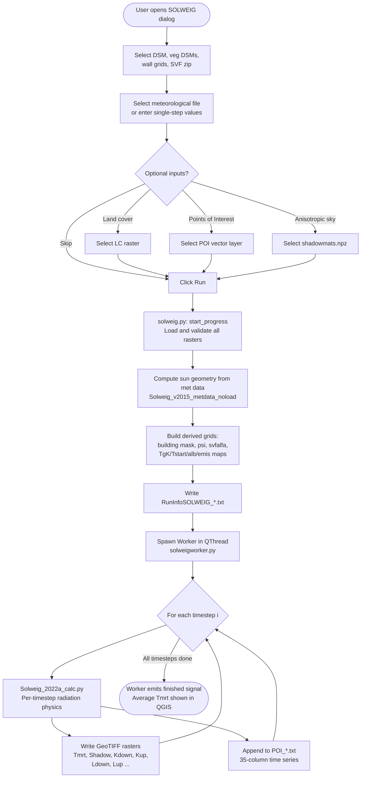
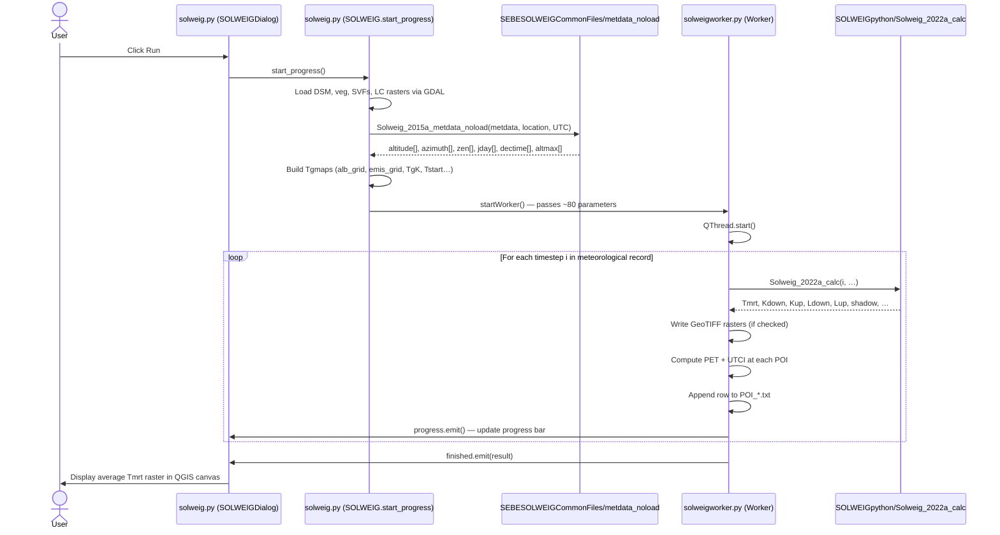
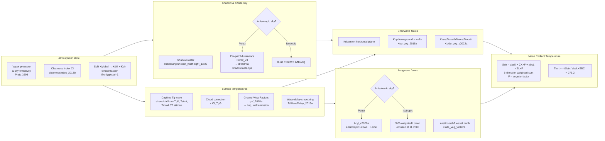

# SOLWEIG Overview

**SOLWEIG** (Solar and Longwave Environmental Irradiance model) is a spatially explicit radiation model for urban outdoor thermal comfort. It is implemented as a QGIS plugin inside the [UMEP](https://github.com/UMEP-dev/UMEP) suite.

This document is a technical introduction for new contributors. It maps concepts to actual source files and functions so you can trace any detail in the code.

---

## Table of Contents

1. [What SOLWEIG Does](#1-what-solweig-does)
2. [Main Inputs and Required Data](#2-main-inputs-and-required-data)
3. [End-to-End Processing Pipeline](#3-end-to-end-processing-pipeline)
4. [Core Calculation Logic](#4-core-calculation-logic)
5. [Outputs and How to Interpret Them](#5-outputs-and-how-to-interpret-them)
6. [Assumptions, Limitations, and Common Pitfalls](#6-assumptions-limitations-and-common-pitfalls)

---

## 1. What SOLWEIG Does

Urban microclimates differ dramatically from place to place on the same street. A sunlit plaza may feel 15 °C hotter than a shaded bench 10 m away — not because the air is warmer, but because the human body is absorbing or emitting more radiant energy.

SOLWEIG answers one central question:

> **At every pixel in a city, how much radiation is a standing person receiving from all directions (sky, walls, ground, sun) — and how does that translate into perceived heat stress?**

The primary output is the **Mean Radiant Temperature (Tmrt)**, expressed in °C. Tmrt is the single temperature of a hypothetical uniform enclosure that would produce the same net radiant exchange on the human body as the actual environment. It is the most spatially variable input to indices such as PET and UTCI.

SOLWEIG runs over a time series of meteorological observations and produces one output grid per timestep, plus point-level time series at optional Points of Interest (POIs).

---

## 2. Main Inputs and Required Data

| Input | Format | Source / Notes |
|---|---|---|
| **DSM** (Digital Surface Model) | GeoTIFF raster | Buildings + terrain combined in one elevation model |
| **DEM** (Digital Elevation Model) | GeoTIFF raster | Terrain only. Optional: used to derive the building mask (`DSM − DEM`) |
| **Vegetation canopy DSM (CDSM)** | GeoTIFF raster | Top of canopy heights above ground; optional |
| **Vegetation trunk DSM (TDSM)** | GeoTIFF raster | Bottom of canopy (trunk space); optional, or derived from CDSM × trunk ratio |
| **Sky View Factor zip** (`svfs.zip`) | ZIP of GeoTIFFs | 15 directional SVF grids (buildings + veg) generated by UMEP's *SkyViewFactorCalculator* |
| **Shadow matrices** (`shadowmats.npz`) | NumPy archive | Per-patch shadow fractions for anisotropic Perez sky; optional, from *SkyViewFactorCalculator* |
| **Wall height raster** | GeoTIFF raster | Height of each exterior wall pixel; from UMEP's *WallHeight* tool |
| **Wall aspect raster** | GeoTIFF raster | Cardinal direction (degrees) each wall pixel faces; from *WallHeight* tool |
| **Meteorological file** | Tab-separated text, 24 columns, 1 header row | Columns include year (0), DOY (1), hour (2), min (3), wind speed (9), RH (10), Ta °C (11), P (12), Kglobal (14), Kdiff (21), Kdir (22) |
| **Land cover raster** | GeoTIFF raster | Integer classes 1–7 (see `landcoverclasses_2016a.txt`); optional |
| **POI point layer** | QGIS vector (point) | Optional. Points where full time-series output is written |

All spatial rasters must share the same extent, resolution, and CRS as the DSM.

### Land cover classes

Defined in `SOLWEIG/landcoverclasses_2016a.txt`. Each class carries albedo, emissivity, and surface temperature amplitude parameters used by the thermal model.

| Code | Name | Albedo | Emissivity |
|---|---|---|---|
| 1 | Dark asphalt | 0.18 | 0.95 |
| 2 | Roofs/buildings | 0.18 | 0.95 |
| 5 | Grass (unmanaged) | 0.16 | 0.94 |
| 6 | Bare soil | 0.25 | 0.94 |
| 7 | Water | 0.05 | 0.98 |
| 99 | Walls (internal) | 0.20 | 0.90 |

---

## 3. End-to-End Processing Pipeline

### High-level workflow



### Sequence diagram: user action to results



---

## 4. Core Calculation Logic

The entire per-timestep physics lives in `SOLWEIGpython/Solweig_2022a_calc.py` inside the function `Solweig_2022a_calc(i, …)`.

### 4.1 Daytime vs. nighttime branch

The calculation forks on `altitude > 0`:

- **Nighttime** — all shortwave fluxes are set to zero; longwave upwelling uses the Stefan–Boltzmann law with nocturnal surface temperature.
- **Daytime** — full shortwave and longwave radiation balance is computed.

### 4.2 Daytime computation sequence



### 4.3 Key equations at a glance

**Surface temperature (ground)** — `Solweig_2022a_calc.py:152`
```
Tg = (TgK × altmax + Tstart) × sin(((dectime − SNUP/24) / (TmaxLST/24 − SNUP/24)) × π/2)
Tg = Tg × CI_TgG   # cloud correction
```
where `TgK`, `Tstart`, `TmaxLST` come from the land cover table (`Tgmaps_v1`) or defaults.

**Incoming shortwave on horizontal (daytime)** — `Solweig_2022a_calc.py:202`
```
Kdown = Kdir × shadow × sin(altitude) + dRad + albedo_b × (1 − svfbuveg) × (Kglobal × (1−F_sh) + Kdiff × F_sh)
```

**Tmrt final formula** — `Solweig_2022a_calc.py:334`
```
Sstr = absK × (shortwave fluxes × angular factors) + absL × (longwave fluxes × angular factors)
Tmrt = (Sstr / (absL × σ))^(1/4) − 273.2    [°C]
```
Angular factors `Fside`, `Fup`, `Fcyl` differ by posture (standing vs. seated).

### 4.4 Angular factors by posture

Set in `solweig.py:718–727`:

| Posture | Fside | Fup | Fcyl | Height |
|---|---|---|---|---|
| Standing (pos=0) | 0.22 | 0.06 | 0.28 | 1.1 m |
| Seated (pos=1) | 0.167 | 0.167 | 0.20 | 0.75 m |

### 4.5 Thermal comfort indices at POIs

Computed in `solweigworker.py:375–380`:

- **PET** — Physiological Equivalent Temperature (`PET_calculations.py`, `_PET()`). Wind speed is power-law adjusted to 1.1 m.
- **UTCI** — Universal Thermal Climate Index (`UTCI_calculations.py`, `utci_calculator()`). Wind speed adjusted to 10 m.

Both use Tmrt from the grid cell at the POI pixel location.

### 4.6 SVF arrays decoded

The SVF zip contains 15 rasters (+ 4 more when vegetation is used):

| Array | Meaning |
|---|---|
| `svf` | Fraction of sky visible from ground (buildings only) |
| `svfN/S/E/W` | Directional SVFs for cardinal wall faces |
| `svfveg` | Sky fraction blocked by vegetation canopy |
| `svfaveg` | Sky-from-vegetation blocked by buildings |
| `svfNaveg` etc. | Directional, vegetation–building combinations |

Combined: `svfbuveg = svf − (1 − svfveg) × (1 − trans)` — effective sky fraction accounting for vegetation transmissivity.

---

## 5. Outputs and How to Interpret Them

### Raster outputs (one GeoTIFF per timestep, per selected variable)

Filenames follow the pattern `<Variable>_YYYY_DOY_HHMMw.tif` where `w` = `D` (daytime) or `N` (nighttime).

| File | Variable | Unit | Notes |
|---|---|---|---|
| `Tmrt_*.tif` | Mean Radiant Temperature | °C | Primary output; spatial pattern of radiant heat load |
| `Shadow_*.tif` | Shadow fraction | 0–1 | 1 = fully sunlit, 0 = fully shaded |
| `Kdown_*.tif` | Downward shortwave on horizontal | W m⁻² | Total incident solar on ground surface |
| `Kup_*.tif` | Upward shortwave from ground | W m⁻² | Reflected solar leaving the surface |
| `Ldown_*.tif` | Downward longwave | W m⁻² | Thermal radiation from sky + walls toward ground |
| `Lup_*.tif` | Upward longwave | W m⁻² | Thermal emission from ground surface |
| `Kdiff_*.tif` | Diffuse shortwave | W m⁻² | Written only when TreePlanter mode is enabled |

### Point of Interest output (`POI_<name>.txt`)

One file per named POI, one row per timestep, 35 space-separated columns:

```
yyyy  id  it  imin  dectime  altitude  azimuth  kdir  kdiff  kglobal
kdown  kup  keast  ksouth  kwest  knorth  ldown  lup  least  lsouth
lwest  lnorth  Ta  Tg  RH  Esky  Tmrt  I0  CI  Shadow  SVF_b  SVF_bv
KsideI  PET  UTCI
```

Key columns for thermal comfort analysis:

| Column | Meaning |
|---|---|
| `Tmrt` (col 26) | Mean Radiant Temperature at that pixel |
| `PET` (col 33) | Physiological Equivalent Temperature |
| `UTCI` (col 34) | Universal Thermal Climate Index |
| `CI` (col 28) | Clearness index (0 = overcast, 1 = clear sky) |
| `Shadow` (col 29) | 0 = full sun, 1 = full shade |

### Metadata file (`RunInfoSOLWEIG_*.txt`)

Written once per run by `WriteMetadataSOLWEIG.writeRunInfo()`. Records all run settings (CRS, file paths, parameter values) for reproducibility.

### Average Tmrt layer

After the run, `Worker.finished` emits the time-averaged `tmrtplot` array, which `solweig.py` renders as a temporary QGIS raster layer.

---

## 6. Assumptions, Limitations, and Common Pitfalls

### Assumptions

- The human body is modelled as a **standing cylinder** (default) or seated cube. Angular factors are fixed for each posture — there is no person-orientation dependency.
- **Surface temperatures** follow a sinusoidal diurnal wave parameterised by `TgK`, `Tstart`, and `TmaxLST` from the land cover table. This is a simplified parameterisation; measured surface temperatures would be more accurate.
- **Vegetation transmissivity** (`psi`) is a single scalar per run, not spatially variable. Deciduous canopies switch between leaf-on and leaf-off based on day-of-year thresholds.
- Wind speed is not spatially resolved — a single station value is used for PET/UTCI at all POIs.
- All rasters must share the **same CRS, extent, and resolution**. SOLWEIG does not reproject or resample internally.

### Limitations

- **Computation time** scales with grid size × number of timesteps. The QGIS UI warns at >250k, >1M, >4M, >16M pixels. There is no parallelism within a run.
- Anisotropic sky (Perez model) requires pre-computed `shadowmats.npz` from the *SkyViewFactorCalculator*. This is the most accurate diffuse radiation scheme but requires extra pre-processing.
- PET and UTCI are only written for **POI locations**, not as full spatial grids.
- The model runs as a **QThread in QGIS** — it cannot be run headlessly without modification (cf. SuPy for headless urban physics).

### Common pitfalls

| Problem | Likely cause |
|---|---|
| "Wrong number of columns in meteorological data" | Met file must have exactly 24 columns. Prepare via UMEP *MetdataProcessor*. |
| Diffuse or direct radiation shows -999 | Met file lacks measured Kdiff/Kdir. Enable "Estimate diffuse and direct shortwave" in the dialog. |
| SVF import error | The `svfs.zip` is for a different domain size than the DSM. Rerun *SkyViewFactorCalculator*. |
| LC classes 3 or 4 rejected | Conifer (3) and deciduous (4) classes indicate tree pixels but SOLWEIG requires the ground cover underneath. Reclassify before use. |
| NoData pixels in DSM causing artifacts | Set a valid NoData value in the raster. SOLWEIG sets DSM NoData to 0, which may merge buildings with flat ground. |
| DEM/DSM raise mismatch warning | DEM and DSM negative offsets differ by > 0.5 m — building heights will be wrong. Align datums. |
| Very slow runtime | Grid has millions of pixels. Consider clipping to study area, or reducing timestep count. |

---

## Module Map

For quick navigation when reading the code:

```
SOLWEIG/
├── solweig.py                   ← Plugin entry point, UI, input loading, validation
├── solweig_dialog.py            ← Qt dialog class (auto-generated from .ui)
├── solweig_dialog_base.ui       ← Qt Designer file with all dialog widgets
├── solweigworker.py             ← QThread Worker: main time loop, raster + POI writing
├── PET_calculations.py          ← _PET() function (Physiological Equivalent Temperature)
├── UTCI_calculations.py         ← utci_calculator() (UTCI polynomial approximation)
├── WriteMetadataSOLWEIG.py      ← writeRunInfo() — run log to RunInfoSOLWEIG_*.txt
├── landcoverclasses_2016a.txt   ← LC class properties table (albedo, emissivity, Tg params)
└── SOLWEIGpython/
    ├── Solweig_2022a_calc.py    ← Core per-timestep physics (THE main function)
    ├── gvf_2018a.py             ← Ground View Factors → Lup from ground/walls
    ├── Tgmaps_v1.py             ← Maps LC class properties to per-pixel grids
    ├── TsWaveDelay_2015a.py     ← Surface temperature time-delay smoothing
    ├── Kup_veg_2015a.py         ← Upward shortwave from ground + vegetation
    ├── Kside_veg_v2022a.py      ← Sidewall shortwave (Perez / isotropic)
    ├── Lside_veg_v2022a.py      ← Sidewall longwave from cardinal directions
    ├── Lcyl_v2022a.py           ← Anisotropic longwave on cylinder (Perez)
    ├── cylindric_wedge.py       ← Angular factor F_sh (shadow on cylinder wall)
    ├── sunonsurface_2018a.py    ← Which wall pixels are sunlit
    ├── patch_characteristics.py ← Sky-dome patch geometry for Perez model
    ├── daylen.py                ← Sunrise time SNUP from latitude + DOY
    └── emissivity_models.py     ← Atmospheric emissivity formulations

../Utilities/SEBESOLWEIGCommonFiles/
    ├── clearnessindex_2013b.py          ← CI, I0, Kt from Kglobal
    ├── diffusefraction.py               ← Split Kglobal → Kdiff + Kdir (Reindl 1990)
    ├── shadowingfunction_wallheight_13  ← Shadow raster, buildings only
    ├── shadowingfunction_wallheight_23  ← Shadow raster, buildings + vegetation
    ├── Perez_v3.py                      ← Anisotropic sky luminance distribution
    ├── create_patches.py                ← Sky-dome patch discretisation (145/153/306/612)
    └── Solweig_v2015_metdata_noload.py  ← Parse met file → solar geometry arrays
```
