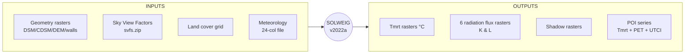
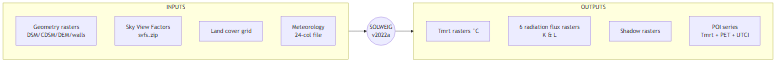
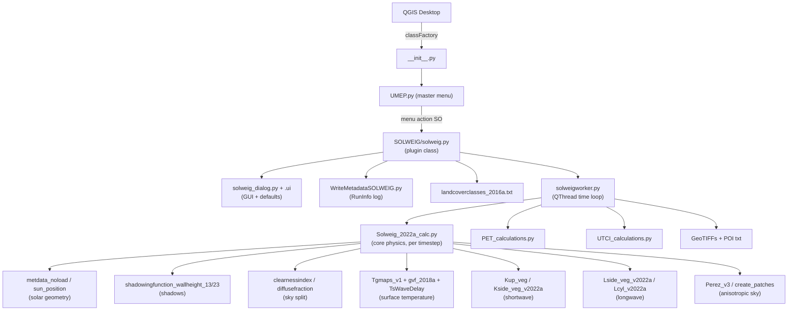
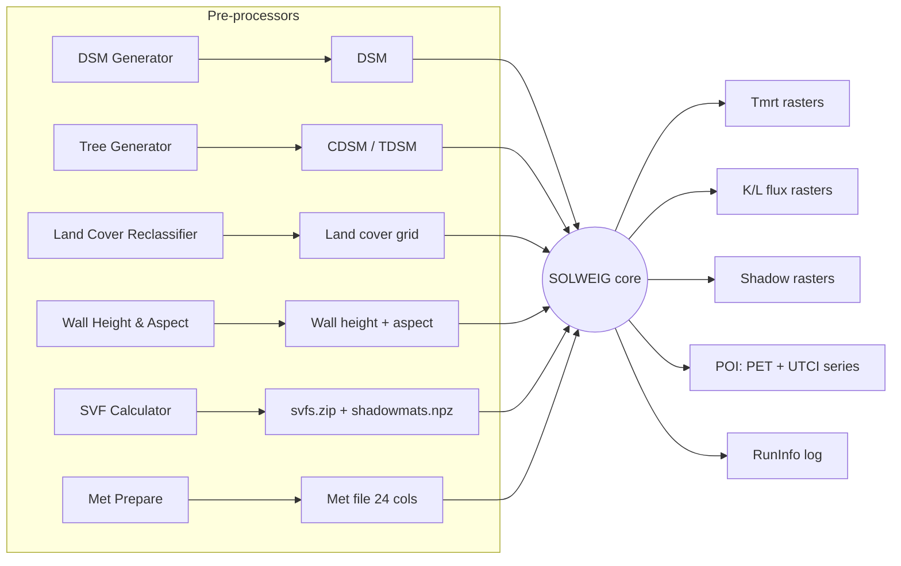
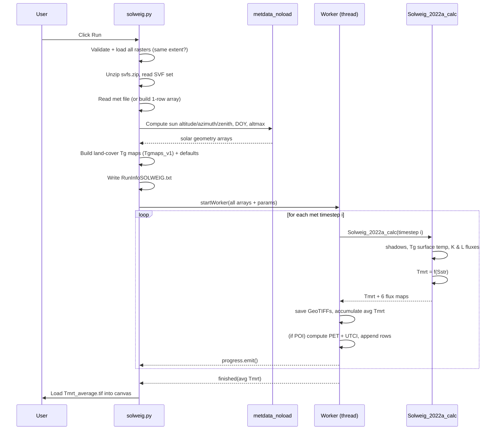
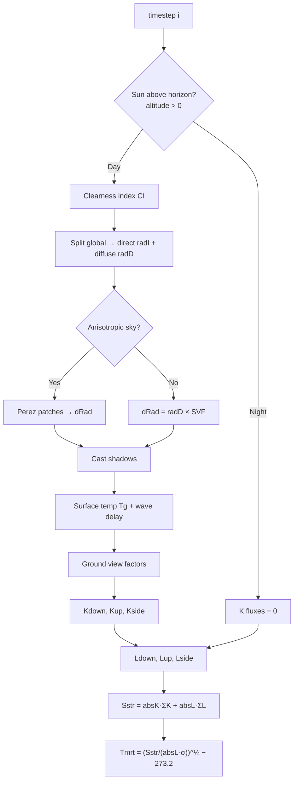
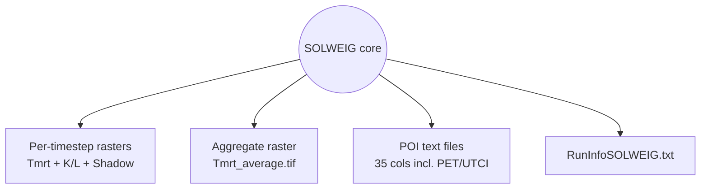
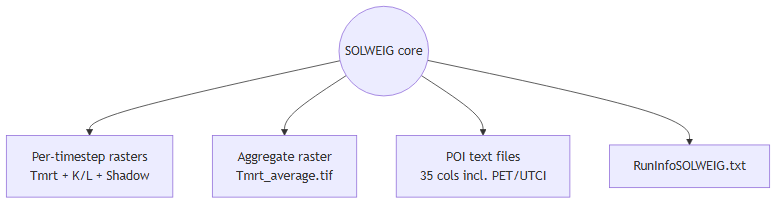

# Weekly Update — SOLWEIG v2022a Analysis (UMEP / QGIS)

**Project:** GA Summer 2026 — UMEP / SOLWEIG study
**Reporting period:** Week of analysis — SOLWEIG v2022a
**Goal of this report:** Document *how SOLWEIG works*, *what inputs produce what outputs*, the *execution sequence and defaults*, the *architecture*, and *how a model is wired into UMEP/QGIS* — so we have the recipe to build a similar plugin ourselves.

> Scope note: this is an architecture, data-flow, and input/output analysis — **not** a line-by-line implementation walkthrough.

---

## Contents

- [Part A — Overview](#part-a--overview)
- [Part B — Architecture & Diagrams](#part-b--architecture--diagrams)
- [Part C — INPUTS (detailed)](#part-c--inputs-detailed)
- [Part D — OUTPUTS (detailed)](#part-d--outputs-detailed)
- [Part E — Input → Output mapping](#part-e--input--output-mapping)
- [Part F — Parameters & default values](#part-f--parameters--default-values)
- [Part G — Execution sequence & defaults](#part-g--execution-sequence--defaults)
- [Part H — How it plugs into UMEP/QGIS (plugin recipe)](#part-h--how-it-plugs-into-umepqgis-plugin-recipe)
- [Part I — Summary & next steps](#part-i--summary--next-steps)
- [Appendix — Files covered](#appendix--files-covered)

---

# Part A — Overview

## A.1 What SOLWEIG is

**SOLWEIG** = *SOlar and LongWave Environmental Irradiance Geometry* model.
It is the **Mean Radiant Temperature (SOLWEIG)** tool inside the **UMEP** QGIS plugin (Outdoor Thermal Comfort group).

> **In one line:** given a 3-D description of an urban surface (buildings, ground, vegetation) + weather, SOLWEIG computes the radiation reaching a person at *every pixel*, and turns it into **Mean Radiant Temperature (Tmrt)** — the dominant driver of outdoor heat stress.

## A.2 The model in one picture (black box)





## A.3 The governing equation (why the inputs matter)

Per pixel, per timestep, SOLWEIG sums radiation from **6 directions** (up, down, N, E, S, W) for both shortwave (**K**) and longwave (**L**):

```
Sstr = absK · (Σ shortwave fluxes from all directions)
     + absL · (Σ longwave fluxes from all directions)

Tmrt = (Sstr / (absL · σ))^(1/4) − 273.2        [°C]
```

| Symbol | Meaning | Comes from |
|--------|---------|-----------|
| `σ` | Stefan–Boltzmann constant (5.67051e-8) | hard-coded |
| `absK` | human shortwave absorption | parameter (default 0.70) |
| `absL` | human longwave absorption | parameter (default 0.95) |
| `K↓ K↑ Kside` | shortwave fluxes | sun + shadows + albedo + SVF |
| `L↓ L↑ Lside` | longwave fluxes | air/surface temp + emissivity + SVF |

**Takeaway:** every input below exists to feed one of those flux terms. Knowing *which input drives which flux* is the key to reading the output — see [Part E](#part-e--input--output-mapping).

## A.4 Two resolutions of "unit"

| Unit | Meaning |
|------|---------|
| **Spatial unit** | one raster pixel (e.g. 1 m or 2 m grid cell) |
| **Time unit** | one row of the meteorological file (one timestep) |

The model is therefore a **loop over timesteps**, each producing **full maps** plus optional **point time-series**.

---

# Part B — Architecture & Diagrams

## B.1 Two-layer design (mental model)

| Layer | File(s) | Responsibility |
|-------|---------|----------------|
| **Orchestration / GUI** | `solweig.py`, `solweig_dialog.*` | collect inputs, validate, set defaults, manage thread, write outputs |
| **Physics core** | `Solweig_2022a_calc.py` + `SOLWEIGpython/*` | one timestep of radiation physics → Tmrt + fluxes |

## B.2 Hierarchical / module structure




## B.3 Data flow (inputs → model → outputs)




## B.4 Execution sequence (runtime)




## B.5 Per-timestep physics (inside the core calc)




---

# Part C — INPUTS (detailed)

SOLWEIG has **three input categories**: (1) spatial rasters, (2) the meteorological file, (3) scalar parameters (GUI). This part documents 1 and 2 in full; parameters are in [Part F](#part-f--parameters--default-values).

## C.1 Spatial raster inputs

> **Hard rule:** every raster must share the **same extent, resolution, and pixel grid** as the DSM, or the run aborts with an error dialog.

| # | Input | File type | Unit | Required? | Produced by | Feeds (model use) |
|---|-------|-----------|------|-----------|-------------|-------------------|
| 1 | **DSM** — ground + buildings | GeoTIFF | metres | **Yes (always)** | DSM Generator | shadows, building height, `scale`, lat/lon, altitude |
| 2 | **CDSM** — vegetation canopy | GeoTIFF | metres | Optional (veg scheme) | Tree Generator | vegetation shadows, transmissivity `psi` |
| 3 | **TDSM** — vegetation trunk zone | GeoTIFF | metres | Optional | Tree Generator *or* auto `= CDSM × trunk-ratio` | below-canopy geometry |
| 4 | **DEM** — bare ground | GeoTIFF | metres | Only if buildings **not** from land cover | DSM Generator | separate buildings from ground (`buildings = DSM − DEM`) |
| 5 | **Land cover grid** | GeoTIFF | class code 1–7 | Optional (LC scheme) | Land Cover Reclassifier | per-surface albedo/emissivity/Tg via `Tgmaps_v1` |
| 6 | **Wall height** | GeoTIFF | metres | **Yes** | Wall Height & Aspect | wall longwave/shortwave geometry |
| 7 | **Wall aspect** | GeoTIFF | degrees 0–360 | **Yes** | Wall Height & Aspect | direction each wall faces |
| 8 | **SVF set** `svfs.zip` | zipped GeoTIFFs | fraction 0–1 | **Yes** | Sky View Factor Calculator | sky fraction per direction (see C.2) |
| 9 | **Shadow matrices** `shadowmats.npz` | NumPy archive | — | Optional (anisotropic sky) | Sky View Factor Calculator | per-sky-patch shadowing (Perez) |
| 10 | **POI point layer** | vector (points) | — | Optional | user | locations for PET/UTCI time-series |

### C.1.1 Contents of `svfs.zip`

| Group | Files | Meaning |
|-------|-------|---------|
| Total + cardinal | `svf, svfN, svfS, svfE, svfW` | sky fraction (building geometry) |
| Vegetation (sky-blocking) | `svfveg, svfNveg, svfSveg, svfEveg, svfWveg` | canopy blocking sky |
| Vegetation (building-blocking) | `svfaveg, svfNaveg, svfSaveg, svfEaveg, svfWaveg` | canopy blocking buildings |

If the vegetation scheme is **off**, all veg SVFs default to `ones` (no blocking).

## C.2 Meteorological input — the 24-column file

A space-delimited text file, **1 header row + 24 columns**, in the UMEP "Prepare Existing Data" format. SOLWEIG only reads a subset; the rest can be `-999` (missing). Full layout:

| Col (0-idx) | Name | SOLWEIG uses it? | Variable | Unit |
|-------------|------|:---:|----------|------|
| 0 | iy | ✅ | Year | YYYY |
| 1 | id | ✅ | Day of year (DOY) | 1–366 |
| 2 | it | ✅ | Hour | 0–23 |
| 3 | imin | ✅ | Minute | 0–59 |
| 4 | qn | — | Net radiation | W/m² |
| 5 | qh | — | Sensible heat | W/m² |
| 6 | qe | — | Latent heat | W/m² |
| 7 | qs | — | Storage heat | W/m² |
| 8 | qf | — | Anthropogenic heat | W/m² |
| 9 | U | ✅ | **Wind speed `Ws`** | m/s |
| 10 | RH | ✅ | **Relative humidity** | % |
| 11 | Tair | ✅ | **Air temperature `Ta`** | °C |
| 12 | pres | ✅ | **Pressure `P`** | kPa |
| 13 | rain | — | Rainfall | mm |
| 14 | kdown | ✅ | **Global radiation `radG`** | W/m² |
| 15 | snow | — | Snow | mm |
| 16 | ldown | — | Incoming longwave | W/m² |
| 17 | fcld | — | Cloud fraction | — |
| 18 | wuh | — | External water use | — |
| 19 | xsmd | — | Soil moisture | — |
| 20 | lai | — | Leaf area index | — |
| 21 | kdiff | ✅ | **Diffuse radiation `radD`** | W/m² |
| 22 | kdir | ✅ | **Direct radiation `radI`** | W/m² |
| 23 | wdir | — | Wind direction | ° |

**Notes**
- `radD`/`radI` may be `-999` **only if** "Estimate diffuse & direct from global" is ticked (then they are derived from `radG`).
- `Ws` is required only if POIs are used (needed for PET/UTCI).
- **Single-timestep alternative:** instead of a file, the GUI lets the user enter one timestep (calendar + spinboxes), which builds a 1-row version of this same array.

## C.3 What the core function receives per timestep

Each `Solweig_2022a_calc(...)` call is given the *scalar slice* of the met arrays for timestep `i` plus all static grids:

| Group | Passed in |
|-------|-----------|
| Geometry (static) | `dsm, vegdem, vegdem2, walls, dirwalls, buildings, scale, rows, cols` |
| Sky view factors (static) | all 15 `svf*` grids, `svfalfa`, `svfbuveg` |
| Solar (per-step scalars) | `altitude[i], azimuth[i], zen[i], jday[i], altmax[i], dectime[i]` |
| Weather (per-step scalars) | `Ta[i], RH[i], radG[i], radD[i], radI[i], P[i]` |
| Surface temp maps | `TgK, Tstart, alb_grid, emis_grid, TgK_wall, ...` |
| Human/parameters | `absK, absL, ewall, albedo_b, Fside, Fup, Fcyl, cyl` |
| Mode flags | `usevegdem, onlyglobal, landcover, anisotropic_sky` |

---

# Part D — OUTPUTS (detailed)

SOLWEIG produces **three output products**: (1) raster maps per timestep, (2) point time-series (POIs), (3) a run-info log.

## D.1 Raster outputs (one GeoTIFF per timestep per checked variable)

**Filename pattern:** `Var_YYYY_DOY_HHMM[D|N].tif`  (`D` = daytime, `N` = nighttime)

| Output raster | Meaning | Unit | GUI toggle | Day/Night |
|---------------|---------|------|-----------|-----------|
| `Tmrt_*` | **Mean Radiant Temperature** (headline output) | °C | CheckBoxTmrt | both |
| `Kdown_*` | Incoming shortwave | W/m² | CheckBoxKdown | day only (0 at night) |
| `Kup_*` | Reflected shortwave (upward) | W/m² | CheckBoxKup | day only |
| `Ldown_*` | Incoming longwave | W/m² | CheckBoxLdown | both |
| `Lup_*` | Outgoing longwave | W/m² | CheckBoxLup | both |
| `Shadow_*` | Shadow map (0 = shaded → 1 = sunlit) | 0–1 | CheckBoxShadow | day only |
| `Kdiff*` | Diffuse shortwave (for TreePlanter / Spatial TC) | W/m² | TreePlanter box | day only |

**Aggregate / auxiliary outputs**

| File | Meaning | Condition |
|------|---------|-----------|
| `Tmrt_average.tif` | Run-average Tmrt; auto-loaded to canvas, styled with `tmrt.qml` | "Add to canvas" |
| `buildings.tif` | Derived building mask | optional checkbox |
| `TDSM.tif` | Derived trunk-zone DSM | optional checkbox |
| `RunInfoSOLWEIG_*.txt` | Full settings record (reproducibility) | **always** |

## D.2 POI output — the 35-column dictionary

If a POI point layer is selected, each point gets a file `POI_<name>.txt` with one row per timestep. Full column dictionary (from the code header):

| Col | Name | Meaning | Unit |
|-----|------|---------|------|
| 0 | yyyy | Year | YYYY |
| 1 | id | Day of year | DOY |
| 2 | it | Hour | h |
| 3 | imin | Minute | min |
| 4 | dectime | Decimal time | — |
| 5 | altitude | Sun altitude | ° |
| 6 | azimuth | Sun azimuth | ° |
| 7 | kdir | Direct shortwave (`radI`) | W/m² |
| 8 | kdiff | Diffuse shortwave (`radD`) | W/m² |
| 9 | kglobal | Global shortwave (`radG`) | W/m² |
| 10 | kdown | Incoming shortwave at point | W/m² |
| 11 | kup | Reflected shortwave | W/m² |
| 12–15 | keast, ksouth, kwest, knorth | Shortwave from 4 sides | W/m² |
| 16 | ldown | Incoming longwave | W/m² |
| 17 | lup | Outgoing longwave | W/m² |
| 18–21 | least, lsouth, lwest, lnorth | Longwave from 4 sides | W/m² |
| 22 | Ta | Air temperature | °C |
| 23 | Tg | Ground surface temperature | °C |
| 24 | RH | Relative humidity | % |
| 25 | Esky | Sky emissivity | — |
| 26 | **Tmrt** | Mean Radiant Temperature | °C |
| 27 | I0 | Extraterrestrial radiation | W/m² |
| 28 | CI | Clearness index | — |
| 29 | Shadow | Shadow flag at point | 0–1 |
| 30 | SVF_b | Sky View Factor (buildings) | — |
| 31 | SVF_bv | Sky View Factor (buildings+veg) | — |
| 32 | KsideI | Direct shortwave on cylinder side | W/m² |
| 33 | **PET** | Physiological Equivalent Temperature | °C |
| 34 | **UTCI** | Universal Thermal Climate Index | °C |

> Wind is rescaled by a power law before comfort indices: **1.1 m** height for PET, **10 m** for UTCI.

## D.3 Output summary by product





---

# Part E — Input → Output mapping

This is the "to what parameter, what output" matrix: which inputs/parameters drive which outputs. ✅ = strong/direct effect.

| Input / parameter | Tmrt | Kdown | Kup | Ldown | Lup | Shadow | PET/UTCI |
|-------------------|:----:|:-----:|:---:|:-----:|:---:|:------:|:--------:|
| DSM geometry | ✅ | ✅ | ✅ | ✅ | ✅ | ✅ | ✅ |
| CDSM / TDSM (vegetation) | ✅ | ✅ | ✅ | ✅ | ✅ | ✅ | ✅ |
| SVF set | ✅ | ✅ | ✅ | ✅ | ✅ | — | ✅ |
| Wall height / aspect | ✅ | — | — | ✅ | ✅ | ✅ | ✅ |
| Land cover (albedo/emis) | ✅ | ✅(refl) | ✅ | ✅ | ✅ | — | ✅ |
| `radG / radI / radD` | ✅ | ✅ | ✅ | — | — | — | ✅ |
| `Ta` (air temp) | ✅ | — | — | ✅ | ✅ | — | ✅ |
| `RH` | ✅ | — | — | ✅(esky) | — | — | ✅ |
| Sun position (DOY/UTC/lat) | ✅ | ✅ | ✅ | — | — | ✅ | ✅ |
| `absK / absL` | ✅ | — | — | — | — | — | ✅ |
| `albedo_b` (walls) | ✅ | ✅ | ✅ | — | — | — | ✅ |
| `ewall` (emissivity) | ✅ | — | — | ✅ | ✅ | — | ✅ |
| Posture (standing/sitting) | ✅ | — | — | — | — | — | ✅ |
| Body model (cube/cylinder) | ✅ | — | — | — | — | — | ✅ |
| Sky model (iso/anisotropic) | ✅ | ✅(diffuse) | — | ✅ | — | — | ✅ |
| `Ws` (wind speed) | — | — | — | — | — | — | ✅ |

**Reading guide:**
- To change **shortwave** outputs → change geometry, SVF, albedo, radiation inputs, sun position.
- To change **longwave** outputs → change `Ta`, `RH`, emissivity, wall geometry, SVF.
- **PET/UTCI** depend on Tmrt **plus** wind + humidity + the body parameters.

---

# Part F — Parameters & default values

Defaults come from the dialog (`solweig_dialog_base.ui`) and hard-coded branches.

## F.1 GUI parameter defaults

| Parameter | Default | Range | Used in |
|-----------|---------|-------|---------|
| Global radiation (manual) | 895 | 1–1300 | single-timestep mode |
| Air temperature `Ta` (manual) | 23 °C | −40–50 | single-timestep mode |
| Relative humidity `RH` (manual) | 30 % | 1–100 | single-timestep mode |
| Direct radiation `radI` (manual) | 810 | 1–1200 | single-timestep mode |
| Diffuse radiation `radD` (manual) | 92.5 | 1–600 | single-timestep mode |
| UTC offset | 1 | −12–12 | sun position |
| Water temperature | 15 °C | −40–50 | water surfaces |
| Wind speed `Ws` | 3.0 m/s | 0.1–60 | PET/UTCI |
| Sensor height | 10.0 m | ≥0.1 | wind power-law rescale |
| Vegetation transmissivity `trans` | 3 % | — | shortwave through canopy |
| Albedo, walls `albedo_b` | 0.20 | 0.01–1 | reflections |
| Albedo, ground `albedo_g` | 0.15 | 0.01–1 | only if LC scheme **off** |
| Emissivity, walls `ewall` | 0.90 | 0.01–1 | longwave |
| Emissivity, ground `eground` | 0.95 | 0.01–1 | only if LC scheme **off** |
| Shortwave absorption `absK` | 0.70 | 0.01–1 | Tmrt |
| Longwave absorption `absL` | 0.95 | 0.01–1 | Tmrt |
| PET body weight | 75 kg | — | PET |
| PET height | 180 cm | — | PET |

## F.2 Hard-coded defaults

| Quantity | Default | Notes |
|----------|---------|-------|
| Altitude (site elevation) | `median(DSM)`, else **3 m** | for sun calc |
| Posture **Standing** | Fside 0.22, Fup 0.06, Fcyl 0.28, h 1.1 m | person↔surface angular factors |
| Posture **Sitting** | Fside Fup 0.1667, Fcyl 0.2, h 0.75 m | |
| Stefan–Boltzmann `SBC` | 5.67051e-8 | |
| Veg `psi` (leaf-off) | 0.5 | transmissivity, no leaves |
| Leaf-on / off DOY | 97 / 300 | overridden by GUI for deciduous |
| Surface temp (no LC) | TgK 0.37, Tstart −3.41, TmaxLST 15.0 | cobble-stone-like |
| Clearness index `CI` | init 1.0, clamped ≤1 | cloudiness |
| Sky model default | **Isotropic** | anisotropic only if Perez ticked |
| Body model default | **Cube** | cylinder only if ticked |

## F.3 Land-cover property table (`landcoverclasses_2016a.txt`)

| Name | Code | Albedo | Emis | Ts_deg | Tstart | TmaxLST |
|------|------|--------|------|--------|--------|---------|
| Roofs (buildings) | 2 | 0.18 | 0.95 | 0.58 | −9.78 | 15.0 |
| Dark asphalt | 1 | 0.18 | 0.95 | 0.58 | −9.78 | 15.0 |
| Cobble stone | 0 | 0.20 | 0.95 | 0.37 | −3.41 | 15.0 |
| Water | 7 | 0.05 | 0.98 | 0.00 | 0.00 | 12.0 |
| Grass (unmanaged) | 5 | 0.16 | 0.94 | 0.21 | −3.38 | 14.0 |
| Bare soil | 6 | 0.25 | 0.94 | 0.33 | −3.01 | 14.0 |
| Walls | 99 | 0.20 | 0.90 | 0.58 | −3.41 | 15.0 |

Valid LC codes: **1–7**. Codes 3 & 4 (conifer/deciduous *canopy*) are rejected — the **under-canopy ground** class is required instead.

---

# Part G — Execution sequence & defaults

1. **Load (QGIS startup).** QGIS reads `metadata.txt`, calls `classFactory` in `__init__.py` → builds `UMEP`; `UMEP.py` adds menu item *Mean Radiant Temperature (SOLWEIG)*.
2. **Open dialog.** Menu → `SO()` → `SOLWEIG(iface).run()` → modal dialog with `.ui` defaults.
3. **Collect & validate inputs** (`start_progress`):
   - Read DSM → `scale = 1/pixel-size`, lat/lon (corner reprojected to WGS84), altitude = median(DSM) (else 3 m).
   - NoData: negatives raised so min = 0; NoData → 0.
   - Optionally load CDSM/TDSM (or derive TDSM = CDSM × trunk-ratio), land cover, DEM, walls.
   - **Extent/resolution check** against DSM, else abort.
   - Unzip `svfs.zip`; if anisotropic, load `shadowmats.npz` and infer patch count (145/153/306/612).
4. **Met & solar geometry.** Parse 24-col file (or 1-row GUI array); `Solweig_2015a_metdata_noload` → sun position, DOY, daily max altitude.
5. **Surface-temp maps.** LC on → `Tgmaps_v1` per-pixel coefficients; else uniform defaults.
6. **Logging.** `WriteMetadataSOLWEIG.writeRunInfo` → settings file.
7. **Threaded time loop** (`solweigworker.py`): per timestep → `Solweig_2022a_calc`, save rasters, accumulate avg Tmrt, (POIs) compute PET + UTCI.
8. **Finish.** Save avg Tmrt, style + load into canvas, success dialog.

**Day vs night branch:** at night all shortwave fluxes are 0 (only longwave computed); during day full shadow + clearness + K+L budgets run. Tmrt then derived from `Sstr` using the body-model combination (cube/cylinder × isotropic/anisotropic).

---

# Part H — How it plugs into UMEP/QGIS (plugin recipe)

The most reusable part for building our own plugin.

## H.1 The minimal QGIS plugin contract

A QGIS plugin is a folder under the QGIS `python/plugins` directory containing:

1. **`metadata.txt`** — manifest. Mandatory keys: `name`, `qgisMinimumVersion`, `description`, `version`, `author`, `email`, `about`.
2. **`__init__.py`** with one top-level function:

```python
def classFactory(iface):
    from .MyPlugin import MyPlugin
    return MyPlugin(iface)
```

3. A **plugin class** with the methods QGIS calls by name:
   - `initGui(self)` — add menu/toolbar actions.
   - `unload(self)` — remove them.
   - `run(self)` — open your dialog.

That is the entire contract; the rest is ordinary Python (Qt + GDAL + NumPy).

## H.2 How SOLWEIG specifically plugs in (the pattern to copy)

UMEP is an umbrella plugin: `UMEP.py` is the plugin class; it registers SOLWEIG as a menu action wired to a callback.

```68:68:UMEP.py
from .SOLWEIG.solweig import SOLWEIG
```
```285:289:UMEP.py
        self.MRT_Action = QAction(
            "Mean Radiant Temperature (SOLWEIG)", self.iface.mainWindow()
        )
        self.OTC_Menu.addAction(self.MRT_Action)
        self.MRT_Action.triggered.connect(self.SO)
```
```753:755:UMEP.py
    def SO(self):
        sg = SOLWEIG(self.iface)
        sg.run()
```

So **each UMEP tool is a self-contained mini-plugin** that the umbrella routes a menu click to.

## H.3 Reusable recipe (SOLWEIG technique → what we copy)

| Concern | SOLWEIG technique → reuse |
|---------|---------------------------|
| Register with QGIS | `metadata.txt` + `classFactory` |
| UI | `.ui` in Qt Designer, loaded via `uic.loadUiType` |
| Pick layers | `QgsMapLayerComboBox` + `QgsMapLayerProxyModel.Filter.RasterLayer`/`PointLayer` |
| Read raster → numpy | `gdal.Open(path).ReadAsArray().astype(float)` |
| Geo info | `GetGeoTransform()` for scale; `osr` to reproject corner for lat/lon |
| Validate inputs | enforce equal extent/resolution; handle NoData; `QMessageBox` errors |
| Long computation | `QThread` `Worker(QObject)` with `finished`/`error`/`progress` signals |
| Progress bar | `progress.emit()` → `progressBar.setValue` |
| Write raster | `gdal.GetDriverByName('GTiff').Create(...)` → `WriteArray` + `SetGeoTransform` + `SetProjection` |
| Reproducibility | write a `RunInfo.txt` of all parameters |
| Defaults & constants | tunables in the `.ui`; per-class properties in a small lookup table file |

## H.4 Minimum viable plugin skeleton

```
MyPlugin/
├── metadata.txt          # name, version, qgisMinimumVersion, ...
├── __init__.py           # classFactory(iface) -> MyPlugin(iface)
├── my_plugin.py          # class with initGui/unload/run + worker
├── my_plugin_dialog.py   # uic.loadUiType wrapper
└── my_plugin_dialog_base.ui
```

**Install for testing:** zip the folder → QGIS → *Plugins → Manage and Install Plugins → Install from ZIP*; or drop the folder into the profile's `python/plugins/` and enable it.

---

# Part I — Summary & next steps

## I.1 Key takeaways

- **Two-layer design:** a thick GUI/orchestration layer (`solweig.py`) + a deep physics core (`Solweig_2022a_calc.py`) run in a worker thread.
- **Inputs are a pipeline:** DSM, SVF, Wall Height/Aspect, Land Cover, Tree, Met Prepare — each from a different UMEP pre-processor; SOLWEIG is the last stage.
- **Outputs are layered:** per-timestep rasters → aggregate Tmrt → POI comfort series → RunInfo log. Headline = **Tmrt**; everything else supports it.
- **Plugin contract is small:** `metadata.txt` + `classFactory` + a class with `initGui`/`unload`/`run`. The heavy lifting is GDAL + NumPy — fully reusable for our own plugin.

## I.2 Next week (proposed)

- Trace `gvf_2018a` and `Kside/Lside_v2022a` math (the 6-direction flux assembly).
- Run SOLWEIG end-to-end on a sample dataset; capture an actual Tmrt map + a POI PET/UTCI series.
- Stand up a "hello world" QGIS plugin skeleton using the recipe in Part H.

---

# Appendix — Files covered

## App.1 Plugin / GUI layer

| File | Role |
|------|------|
| `__init__.py` (root) | QGIS entry point — `classFactory(iface)` returns `UMEP`. |
| `metadata.txt` (root) | Plugin manifest (v4.6, min QGIS 3.0). |
| `UMEP.py` | Master menu; registers SOLWEIG action → `SO()`. |
| `SOLWEIG/solweig.py` | Plugin class: dialog, input load/validate, params, thread launch (~1750 lines). |
| `SOLWEIG/solweig_dialog.py` | Loads the Qt Designer UI. |
| `SOLWEIG/solweig_dialog_base.ui` | Dialog layout + default values. |
| `SOLWEIG/WriteMetadataSOLWEIG.py` | Writes `RunInfoSOLWEIG_*.txt`. |
| `SOLWEIG/landcoverclasses_2016a.txt` | LC code → surface properties. |
| `SOLWEIG/tmrt.qml` | Style for the average-Tmrt raster. |

## App.2 Compute layer

| File | Role |
|------|------|
| `SOLWEIG/solweigworker.py` | Worker thread; the timestep loop + output writing. |
| `SOLWEIGpython/Solweig_2022a_calc.py` | Core model — one timestep of physics. |
| `SOLWEIGpython/Tgmaps_v1.py` | LC grid → surface-temp coefficients. |
| `SOLWEIGpython/gvf_2018a.py` | Ground view factors (per direction). |
| `SOLWEIGpython/Kup_veg_2015a.py` | Reflected/upward shortwave. |
| `SOLWEIGpython/Kside_veg_v2022a.py` | Side shortwave (iso/anisotropic). |
| `SOLWEIGpython/Lside_veg_v2022a.py` | Side longwave. |
| `SOLWEIGpython/Lcyl_v2022a.py` | Anisotropic longwave on cylinder. |
| `SOLWEIGpython/cylindric_wedge.py` | Wall-shadow fraction. |
| `SOLWEIGpython/TsWaveDelay_2015a.py` | Surface-temperature thermal inertia. |
| `SOLWEIGpython/daylen.py` | Sunrise/sunset & day length. |
| `SOLWEIG/PET_calculations.py` | PET at POIs. |
| `SOLWEIG/UTCI_calculations.py` | UTCI at POIs. |

## App.3 Shared utilities (`Utilities/SEBESOLWEIGCommonFiles/`)

| File | Role |
|------|------|
| `Solweig_v2015_metdata_noload.py` | Met parsing + sun position, DOY, daily max altitude. |
| `sun_position.py` | Astronomical solar geometry. |
| `clearnessindex_2013b.py` | Clearness index `CI`. |
| `diffusefraction.py` | Global → direct + diffuse split. |
| `shadowingfunction_wallheight_13/23.py` | Shadows (buildings / buildings+veg). |
| `Perez_v3.py`, `create_patches.py` | Anisotropic sky patches. |
