# SOLWEIG v2022a — Weekly Progress Updates

**Project:** GA Summer 2026 — UMEP / SOLWEIG study (12-week)
**Student:** *San*
**Topic:** Analysis of SOLWEIG v2022a (UMEP QGIS plugin) toward building a similar plugin
**Status:** Completed through **Week 6** (input handling in QGIS 4.0.3); plans for Weeks 3–4, 7+
**Images:** `images/diagrams/` (architecture) · `images/week5_qgis_plugin/` · `images/week6_input_handling/` (screenshots)
**Note:** This document is **self-contained** — it embeds the full technical detail (I/O tables, met/POI dictionaries, parameter defaults, influence matrix, all diagrams, plugin recipe). A condensed reference also exists as `SOLWEIG_Weekly_Analysis.md`.

---

## Project objectives (12-week)

1. Detailed analysis of how SOLWEIG works.
2. Map which inputs/parameters produce which kinds of output.
3. Understand the execution sequence and default values used during a run.
4. Produce architecture diagrams (hierarchy, data flow, execution, physics).
5. Understand how SOLWEIG is added to UMEP and how to add our own package to QGIS.
6. **End goal:** be able to author a similar QGIS plugin ourselves.

### Roadmap at a glance


| Week  | Theme                                                       | Status            |
| ----- | ----------------------------------------------------------- | ----------------- |
| **1** | Setup, orientation & codebase map                           | ✅ Done            |
| **2** | Inputs/outputs, parameters, execution & architecture        | ✅ Done            |
| **3** | Deep dive: radiation physics (shadows, K & L flux assembly) | 🗓 Detailed below |
| **4** | Hands-on run on sample data + output interpretation         | 🗓 Detailed below |
| **5** | Plugin skeleton ("hello world" QGIS plugin)                 | ✅ Done            |
| **6** | Own plugin: input handling, UI & layer selection            | ✅ Done            |
| 7–12  | Build/extend plugin, threading, outputs, validation, docs   | ⏳ Planned         |


---

# Week 1 — Setup, Orientation & Codebase Map

**Dates:** Week 1
**Theme:** Get oriented with UMEP/QGIS, understand what SOLWEIG is for, and map the codebase.

## 1.1 Goals

- Set up the workspace and locate the SOLWEIG source within UMEP.
- Understand the *purpose* and *scientific role* of SOLWEIG.
- Produce a high-level map of the plugin's files and layers.

## 1.2 Tasks completed

- Cloned/opened the UMEP repository and located the `SOLWEIG/` package and shared `Utilities/`.
- Identified SOLWEIG's place in UMEP: **Outdoor Thermal Comfort → Mean Radiant Temperature (SOLWEIG)**.
- Read the plugin manifest (`metadata.txt`) and entry point (`__init__.py`).
- Catalogued all SOLWEIG source files into **GUI**, **compute**, and **shared-utility** layers.

## 1.3 Key findings

**What SOLWEIG is:** *SOlar and LongWave Environmental Irradiance Geometry* — a raster, time-stepping radiation model. Given a 3-D urban surface (buildings, ground, vegetation) + weather, it computes the radiation reaching a person at every pixel and converts it to **Mean Radiant Temperature (Tmrt)**, the dominant driver of outdoor heat stress.

- **Spatial unit** = one raster pixel (e.g. 1 m or 2 m grid cell).
- **Time unit** = one row of the meteorological file (one timestep).
- The model is therefore a **loop over timesteps**, each producing full maps + optional point time-series.

**The governing equation (why every input matters).** Per pixel, per timestep, SOLWEIG sums radiation from **6 directions** (up, down, N, E, S, W) for shortwave (**K**) and longwave (**L**):

```
Sstr = absK · (Σ shortwave fluxes) + absL · (Σ longwave fluxes)
Tmrt = (Sstr / (absL · σ))^(1/4) − 273.2        [°C]
```


| Symbol        | Meaning                                | Source                              |
| ------------- | -------------------------------------- | ----------------------------------- |
| `σ`           | Stefan–Boltzmann constant (5.67051e-8) | hard-coded                          |
| `absK`        | human shortwave absorption             | parameter (default 0.70)            |
| `absL`        | human longwave absorption              | parameter (default 0.95)            |
| `K↓ K↑ Kside` | shortwave fluxes                       | sun + shadows + albedo + SVF        |
| `L↓ L↑ Lside` | longwave fluxes                        | air/surface temp + emissivity + SVF |


**Two-layer architecture discovered:**


| Layer               | File(s)                                     | Responsibility                                                       |
| ------------------- | ------------------------------------------- | -------------------------------------------------------------------- |
| Orchestration / GUI | `solweig.py`, `solweig_dialog.`*            | collect inputs, validate, set defaults, manage thread, write outputs |
| Physics core        | `Solweig_2022a_calc.py` + `SOLWEIGpython/*` | one timestep of radiation physics → Tmrt + fluxes                    |


**Hierarchical module map:**

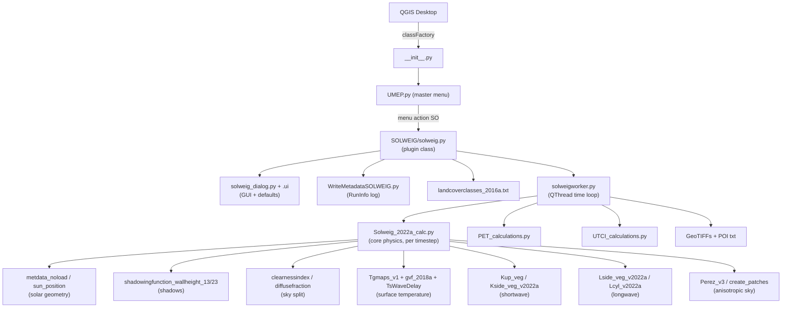

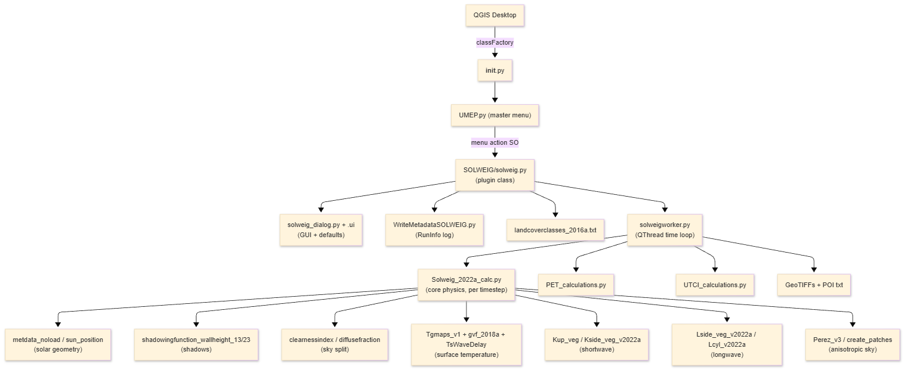


### 1.3.1 Full file catalogue

**Plugin / GUI layer (QGIS-facing)**


| File                                 | Role                                                                             |
| ------------------------------------ | -------------------------------------------------------------------------------- |
| `__init__.py` (UMEP root)            | QGIS entry point — `classFactory(iface)` returns the `UMEP` object.              |
| `metadata.txt` (UMEP root)           | Plugin manifest (name, version 4.6, min QGIS 3.0, changelog).                    |
| `UMEP.py`                            | Master menu builder; registers SOLWEIG action → callback `SO()`.                 |
| `SOLWEIG/solweig.py`                 | Plugin class: dialog, raster load/validate, params, thread launch (~1750 lines). |
| `SOLWEIG/solweig_dialog.py`          | Loads the Qt Designer UI file.                                                   |
| `SOLWEIG/solweig_dialog_base.ui`     | Dialog layout + **default parameter values**.                                    |
| `SOLWEIG/WriteMetadataSOLWEIG.py`    | Writes `RunInfoSOLWEIG_*.txt` (settings record).                                 |
| `SOLWEIG/landcoverclasses_2016a.txt` | LC code → surface thermal/optical properties.                                    |
| `SOLWEIG/tmrt.qml`                   | QGIS style for the average-Tmrt raster.                                          |


**Compute layer (physics)**


| File                                  | Role                                                                           |
| ------------------------------------- | ------------------------------------------------------------------------------ |
| `SOLWEIG/solweigworker.py`            | `Worker` (QThread): the timestep loop + output writing; keeps GUI responsive.  |
| `SOLWEIGpython/Solweig_2022a_calc.py` | **Core model** — one timestep: shadows, surface temp, 6-direction K & L, Tmrt. |
| `SOLWEIGpython/Tgmaps_v1.py`          | LC grid → per-pixel surface-temperature wave coefficients.                     |
| `SOLWEIGpython/gvf_2018a.py`          | Ground View Factors (ground/walls radiating onto a pixel, per direction).      |
| `SOLWEIGpython/Kup_veg_2015a.py`      | Reflected/upward shortwave per direction.                                      |
| `SOLWEIGpython/Kside_veg_v2022a.py`   | Side shortwave (isotropic or Perez anisotropic).                               |
| `SOLWEIGpython/Lside_veg_v2022a.py`   | Side longwave.                                                                 |
| `SOLWEIGpython/Lcyl_v2022a.py`        | Anisotropic longwave onto a cylinder.                                          |
| `SOLWEIGpython/cylindric_wedge.py`    | Wall-shadow fraction seen from a pixel.                                        |
| `SOLWEIGpython/TsWaveDelay_2015a.py`  | Surface-temperature thermal inertia (lag).                                     |
| `SOLWEIGpython/daylen.py`             | Sunrise/sunset & day length.                                                   |
| `SOLWEIG/PET_calculations.py`         | PET at POIs.                                                                   |
| `SOLWEIG/UTCI_calculations.py`        | UTCI at POIs.                                                                  |


**Shared utilities (`Utilities/SEBESOLWEIGCommonFiles/`)**


| File                                    | Role                                                                       |
| --------------------------------------- | -------------------------------------------------------------------------- |
| `Solweig_v2015_metdata_noload.py`       | Met parsing + sun position, DOY, daily max altitude, default leaf-on flag. |
| `sun_position.py`                       | Astronomical solar geometry.                                               |
| `clearnessindex_2013b.py`               | Sky clearness index `CI` (cloudiness proxy).                               |
| `diffusefraction.py`                    | Splits global radiation into direct + diffuse.                             |
| `shadowingfunction_wallheight_13/23.py` | Shadows (buildings / buildings + vegetation).                              |
| `Perez_v3.py`, `create_patches.py`      | Anisotropic sky patches with relative luminance.                           |


## 1.4 Deliverables

- Workspace ready; SOLWEIG source located.
- Full file catalogue (GUI / compute / utilities) — §1.3.1 above.
- High-level hierarchy diagram (above).
- Governing-equation summary.

## 1.5 Challenges / notes

- SOLWEIG is **not** standalone — it is one tool inside the larger UMEP umbrella plugin, so registration is via `UMEP.py` rather than its own `metadata.txt`.
- The core calc file is long and dense; deferred detailed physics to Week 3.

## 1.6 Plan for Week 2

- Document inputs → outputs in detail.
- Capture parameter defaults and execution sequence.
- Produce data-flow, execution, and physics diagrams.

---

# Week 2 — Inputs/Outputs, Parameters, Execution & Architecture

**Dates:** Week 2
**Theme:** Turn the Week-1 map into a precise input/output and execution specification.

## 2.1 Goals

- Specify every input (rasters + 24-column met file) and every output (rasters + POI series).
- Record all parameter defaults (GUI + hard-coded + land-cover table).
- Document the runtime execution sequence and the day/night physics branch.
- Build the remaining architecture diagrams.

## 2.2 Tasks completed

- Traced input loading/validation in `solweig.py` and the timestep loop in `solweigworker.py`.
- Extracted the meteorological column layout and the **35-column POI output dictionary** from the code.
- Pulled all GUI defaults from `solweig_dialog_base.ui` and hard-coded defaults from the source.
- Read `landcoverclasses_2016a.txt` (surface property table).
- Documented how SOLWEIG is registered into the UMEP/QGIS menu.

## 2.3 Key findings — INPUTS (full spec)

SOLWEIG has three input categories: (1) spatial rasters, (2) the meteorological file, (3) scalar parameters (§2.5).

### 2.3.1 Spatial raster inputs

> **Hard rule:** every raster must share the **same extent, resolution, and pixel grid** as the DSM, or the run aborts with an error dialog.


| #   | Input                                | File type       | Unit           | Required?                                 | Produced by                                     | Feeds (model use)                                    |
| --- | ------------------------------------ | --------------- | -------------- | ----------------------------------------- | ----------------------------------------------- | ---------------------------------------------------- |
| 1   | **DSM** — ground + buildings         | GeoTIFF         | metres         | **Yes (always)**                          | DSM Generator                                   | shadows, building height, `scale`, lat/lon, altitude |
| 2   | **CDSM** — vegetation canopy         | GeoTIFF         | metres         | Optional (veg scheme)                     | Tree Generator                                  | vegetation shadows, transmissivity `psi`             |
| 3   | **TDSM** — vegetation trunk zone     | GeoTIFF         | metres         | Optional                                  | Tree Generator *or* auto `= CDSM × trunk-ratio` | below-canopy geometry                                |
| 4   | **DEM** — bare ground                | GeoTIFF         | metres         | Only if buildings **not** from land cover | DSM Generator                                   | `buildings = DSM − DEM`                              |
| 5   | **Land cover grid**                  | GeoTIFF         | class code 1–7 | Optional (LC scheme)                      | Land Cover Reclassifier                         | per-surface albedo/emissivity/Tg via `Tgmaps_v1`     |
| 6   | **Wall height**                      | GeoTIFF         | metres         | **Yes**                                   | Wall Height & Aspect                            | wall longwave/shortwave geometry                     |
| 7   | **Wall aspect**                      | GeoTIFF         | degrees 0–360  | **Yes**                                   | Wall Height & Aspect                            | direction each wall faces                            |
| 8   | **SVF set** `svfs.zip`               | zipped GeoTIFFs | fraction 0–1   | **Yes**                                   | Sky View Factor Calculator                      | sky fraction per direction (2.3.2)                   |
| 9   | **Shadow matrices** `shadowmats.npz` | NumPy archive   | —              | Optional (anisotropic sky)                | Sky View Factor Calculator                      | per-sky-patch shadowing (Perez)                      |
| 10  | **POI point layer**                  | vector (points) | —              | Optional                                  | user                                            | locations for PET/UTCI time-series                   |


### 2.3.2 Contents of `svfs.zip`


| Group                          | Files                                             | Meaning                          |
| ------------------------------ | ------------------------------------------------- | -------------------------------- |
| Total + cardinal               | `svf, svfN, svfS, svfE, svfW`                     | sky fraction (building geometry) |
| Vegetation (sky-blocking)      | `svfveg, svfNveg, svfSveg, svfEveg, svfWveg`      | canopy blocking sky              |
| Vegetation (building-blocking) | `svfaveg, svfNaveg, svfSaveg, svfEaveg, svfWaveg` | canopy blocking buildings        |


If the vegetation scheme is **off**, all veg SVFs default to `ones` (no blocking).

### 2.3.3 Meteorological input — the 24-column file

Space-delimited text, **1 header row + 24 columns** (UMEP "Prepare Existing Data" format). SOLWEIG reads a subset; the rest may be `-999`.


| Col (0-idx) | Name  | Used? | Variable                     | Unit  |
| ----------- | ----- | ----- | ---------------------------- | ----- |
| 0           | iy    | ✅     | Year                         | YYYY  |
| 1           | id    | ✅     | Day of year (DOY)            | 1–366 |
| 2           | it    | ✅     | Hour                         | 0–23  |
| 3           | imin  | ✅     | Minute                       | 0–59  |
| 4           | qn    | —     | Net radiation                | W/m²  |
| 5           | qh    | —     | Sensible heat                | W/m²  |
| 6           | qe    | —     | Latent heat                  | W/m²  |
| 7           | qs    | —     | Storage heat                 | W/m²  |
| 8           | qf    | —     | Anthropogenic heat           | W/m²  |
| 9           | U     | ✅     | **Wind speed `Ws`**          | m/s   |
| 10          | RH    | ✅     | **Relative humidity**        | %     |
| 11          | Tair  | ✅     | **Air temperature `Ta`**     | °C    |
| 12          | pres  | ✅     | **Pressure `P`**             | kPa   |
| 13          | rain  | —     | Rainfall                     | mm    |
| 14          | kdown | ✅     | **Global radiation `radG`**  | W/m²  |
| 15          | snow  | —     | Snow                         | mm    |
| 16          | ldown | —     | Incoming longwave            | W/m²  |
| 17          | fcld  | —     | Cloud fraction               | —     |
| 18          | wuh   | —     | External water use           | —     |
| 19          | xsmd  | —     | Soil moisture                | —     |
| 20          | lai   | —     | Leaf area index              | —     |
| 21          | kdiff | ✅     | **Diffuse radiation `radD`** | W/m²  |
| 22          | kdir  | ✅     | **Direct radiation `radI`**  | W/m²  |
| 23          | wdir  | —     | Wind direction               | °     |


**Notes:** `radD`/`radI` may be `-999` only if "Estimate diffuse & direct from global" is ticked. `Ws` required only when POIs are used. A **single timestep** can be typed in the GUI instead of a file (builds a 1-row version of this array).

## 2.4 Key findings — OUTPUTS (full spec)

### 2.4.1 Raster outputs (one GeoTIFF per timestep per checked variable)

**Filename pattern:** `Var_YYYY_DOY_HHMM[D|N].tif`  (`D` = daytime, `N` = nighttime)


| Output raster | Meaning                                    | Unit | GUI toggle      | Day/Night |
| ------------- | ------------------------------------------ | ---- | --------------- | --------- |
| `Tmrt_`*      | **Mean Radiant Temperature** (headline)    | °C   | CheckBoxTmrt    | both      |
| `Kdown_`*     | Incoming shortwave                         | W/m² | CheckBoxKdown   | day only  |
| `Kup_*`       | Reflected shortwave (upward)               | W/m² | CheckBoxKup     | day only  |
| `Ldown_*`     | Incoming longwave                          | W/m² | CheckBoxLdown   | both      |
| `Lup_*`       | Outgoing longwave                          | W/m² | CheckBoxLup     | both      |
| `Shadow_*`    | Shadow map (0 shaded → 1 sunlit)           | 0–1  | CheckBoxShadow  | day only  |
| `Kdiff*`      | Diffuse shortwave (TreePlanter/Spatial TC) | W/m² | TreePlanter box | day only  |


**Aggregate / auxiliary**


| File                   | Meaning                                                      | Condition       |
| ---------------------- | ------------------------------------------------------------ | --------------- |
| `Tmrt_average.tif`     | Run-average Tmrt; auto-styled (`tmrt.qml`), loaded to canvas | "Add to canvas" |
| `buildings.tif`        | Derived building mask                                        | optional        |
| `TDSM.tif`             | Derived trunk-zone DSM                                       | optional        |
| `RunInfoSOLWEIG_*.txt` | Full settings record (reproducibility)                       | **always**      |


### 2.4.2 POI output — the 35-column dictionary

If a POI point layer is selected, each point gets `POI_<name>.txt`, one row per timestep:


| Col   | Name                         | Meaning                              | Unit |
| ----- | ---------------------------- | ------------------------------------ | ---- |
| 0     | yyyy                         | Year                                 | YYYY |
| 1     | id                           | Day of year                          | DOY  |
| 2     | it                           | Hour                                 | h    |
| 3     | imin                         | Minute                               | min  |
| 4     | dectime                      | Decimal time                         | —    |
| 5     | altitude                     | Sun altitude                         | °    |
| 6     | azimuth                      | Sun azimuth                          | °    |
| 7     | kdir                         | Direct shortwave (`radI`)            | W/m² |
| 8     | kdiff                        | Diffuse shortwave (`radD`)           | W/m² |
| 9     | kglobal                      | Global shortwave (`radG`)            | W/m² |
| 10    | kdown                        | Incoming shortwave at point          | W/m² |
| 11    | kup                          | Reflected shortwave                  | W/m² |
| 12–15 | keast, ksouth, kwest, knorth | Shortwave from 4 sides               | W/m² |
| 16    | ldown                        | Incoming longwave                    | W/m² |
| 17    | lup                          | Outgoing longwave                    | W/m² |
| 18–21 | least, lsouth, lwest, lnorth | Longwave from 4 sides                | W/m² |
| 22    | Ta                           | Air temperature                      | °C   |
| 23    | Tg                           | Ground surface temperature           | °C   |
| 24    | RH                           | Relative humidity                    | %    |
| 25    | Esky                         | Sky emissivity                       | —    |
| 26    | **Tmrt**                     | Mean Radiant Temperature             | °C   |
| 27    | I0                           | Extraterrestrial radiation           | W/m² |
| 28    | CI                           | Clearness index                      | —    |
| 29    | Shadow                       | Shadow flag at point                 | 0–1  |
| 30    | SVF_b                        | Sky View Factor (buildings)          | —    |
| 31    | SVF_bv                       | Sky View Factor (buildings+veg)      | —    |
| 32    | KsideI                       | Direct shortwave on cylinder side    | W/m² |
| 33    | **PET**                      | Physiological Equivalent Temperature | °C   |
| 34    | **UTCI**                     | Universal Thermal Climate Index      | °C   |


> Wind is rescaled by a power law before comfort indices: **1.1 m** for PET, **10 m** for UTCI.

### 2.4.3 Input → output influence matrix

✅ = strong/direct effect.


| Input / parameter           | Tmrt | Kdown | Kup | Ldown | Lup | Shadow | PET/UTCI |
| --------------------------- | ---- | ----- | --- | ----- | --- | ------ | -------- |
| DSM geometry                | ✅    | ✅     | ✅   | ✅     | ✅   | ✅      | ✅        |
| CDSM / TDSM (vegetation)    | ✅    | ✅     | ✅   | ✅     | ✅   | ✅      | ✅        |
| SVF set                     | ✅    | ✅     | ✅   | ✅     | ✅   | —      | ✅        |
| Wall height / aspect        | ✅    | —     | —   | ✅     | ✅   | ✅      | ✅        |
| Land cover (albedo/emis)    | ✅    | ✅     | ✅   | ✅     | ✅   | —      | ✅        |
| `radG / radI / radD`        | ✅    | ✅     | ✅   | —     | —   | —      | ✅        |
| `Ta` (air temp)             | ✅    | —     | —   | ✅     | ✅   | —      | ✅        |
| `RH`                        | ✅    | —     | —   | ✅     | —   | —      | ✅        |
| Sun position (DOY/UTC/lat)  | ✅    | ✅     | ✅   | —     | —   | ✅      | ✅        |
| `absK / absL`               | ✅    | —     | —   | —     | —   | —      | ✅        |
| `albedo_b` (walls)          | ✅    | ✅     | ✅   | —     | —   | —      | ✅        |
| `ewall` (emissivity)        | ✅    | —     | —   | ✅     | ✅   | —      | ✅        |
| Posture (standing/sitting)  | ✅    | —     | —   | —     | —   | —      | ✅        |
| Body model (cube/cylinder)  | ✅    | —     | —   | —     | —   | —      | ✅        |
| Sky model (iso/anisotropic) | ✅    | ✅     | —   | ✅     | —   | —      | ✅        |
| `Ws` (wind speed)           | —    | —     | —   | —     | —   | —      | ✅        |


## 2.5 Key findings — Parameters & default values (full)

### 2.5.1 GUI parameter defaults


| Parameter                         | Default | Range  | Used in                   |
| --------------------------------- | ------- | ------ | ------------------------- |
| Global radiation (manual)         | 895     | 1–1300 | single-timestep mode      |
| Air temperature `Ta` (manual)     | 23 °C   | −40–50 | single-timestep mode      |
| Relative humidity `RH` (manual)   | 30 %    | 1–100  | single-timestep mode      |
| Direct radiation `radI` (manual)  | 810     | 1–1200 | single-timestep mode      |
| Diffuse radiation `radD` (manual) | 92.5    | 1–600  | single-timestep mode      |
| UTC offset                        | 1       | −12–12 | sun position              |
| Water temperature                 | 15 °C   | −40–50 | water surfaces            |
| Wind speed `Ws`                   | 3.0 m/s | 0.1–60 | PET/UTCI                  |
| Sensor height                     | 10.0 m  | ≥0.1   | wind power-law rescale    |
| Vegetation transmissivity `trans` | 3 %     | —      | shortwave through canopy  |
| Albedo, walls `albedo_b`          | 0.20    | 0.01–1 | reflections               |
| Albedo, ground `albedo_g`         | 0.15    | 0.01–1 | only if LC scheme **off** |
| Emissivity, walls `ewall`         | 0.90    | 0.01–1 | longwave                  |
| Emissivity, ground `eground`      | 0.95    | 0.01–1 | only if LC scheme **off** |
| Shortwave absorption `absK`       | 0.70    | 0.01–1 | Tmrt                      |
| Longwave absorption `absL`        | 0.95    | 0.01–1 | Tmrt                      |
| PET body weight                   | 75 kg   | —      | PET                       |
| PET height                        | 180 cm  | —      | PET                       |


### 2.5.2 Hard-coded defaults


| Quantity                  | Default                                  | Notes                            |
| ------------------------- | ---------------------------------------- | -------------------------------- |
| Altitude (site elevation) | `median(DSM)`, else **3 m**              | for sun calc                     |
| Posture **Standing**      | Fside 0.22, Fup 0.06, Fcyl 0.28, h 1.1 m | person↔surface angular factors   |
| Posture **Sitting**       | Fside Fup 0.1667, Fcyl 0.2, h 0.75 m     |                                  |
| Stefan–Boltzmann `SBC`    | 5.67051e-8                               |                                  |
| Veg `psi` (leaf-off)      | 0.5                                      | transmissivity, no leaves        |
| Leaf-on / off DOY         | 97 / 300                                 | overridden by GUI for deciduous  |
| Surface temp (no LC)      | TgK 0.37, Tstart −3.41, TmaxLST 15.0     | cobble-stone-like                |
| Clearness index `CI`      | init 1.0, clamped ≤1                     | cloudiness                       |
| Sky model default         | **Isotropic**                            | anisotropic only if Perez ticked |
| Body model default        | **Cube**                                 | cylinder only if ticked          |


### 2.5.3 Land-cover property table (`landcoverclasses_2016a.txt`)


| Name              | Code | Albedo | Emis | Ts_deg | Tstart | TmaxLST |
| ----------------- | ---- | ------ | ---- | ------ | ------ | ------- |
| Roofs (buildings) | 2    | 0.18   | 0.95 | 0.58   | −9.78  | 15.0    |
| Dark asphalt      | 1    | 0.18   | 0.95 | 0.58   | −9.78  | 15.0    |
| Cobble stone      | 0    | 0.20   | 0.95 | 0.37   | −3.41  | 15.0    |
| Water             | 7    | 0.05   | 0.98 | 0.00   | 0.00   | 12.0    |
| Grass (unmanaged) | 5    | 0.16   | 0.94 | 0.21   | −3.38  | 14.0    |
| Bare soil         | 6    | 0.25   | 0.94 | 0.33   | −3.01  | 14.0    |
| Walls             | 99   | 0.20   | 0.90 | 0.58   | −3.41  | 15.0    |


Valid LC codes: **1–7**. Codes 3 & 4 (conifer/deciduous *canopy*) are rejected — the under-canopy ground class is required instead.

## 2.6 Key findings — Execution & architecture

### 2.6.1 Data flow (inputs → model → outputs)

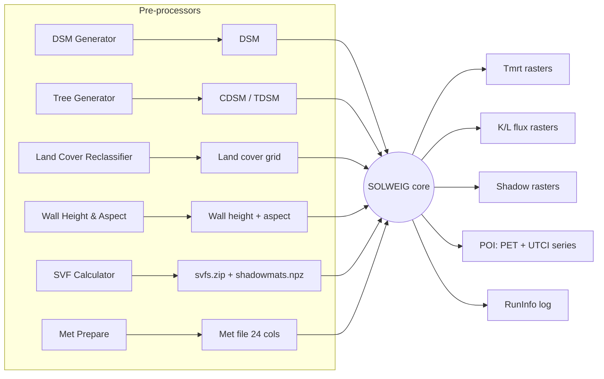

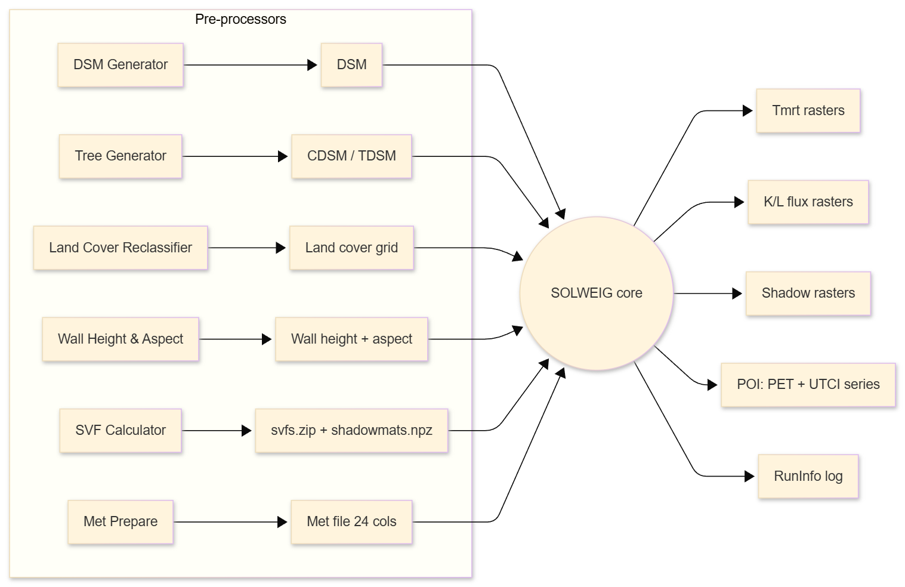


### 2.6.2 Execution sequence (runtime)

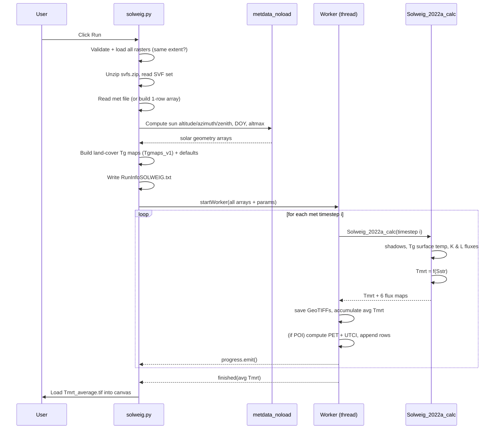

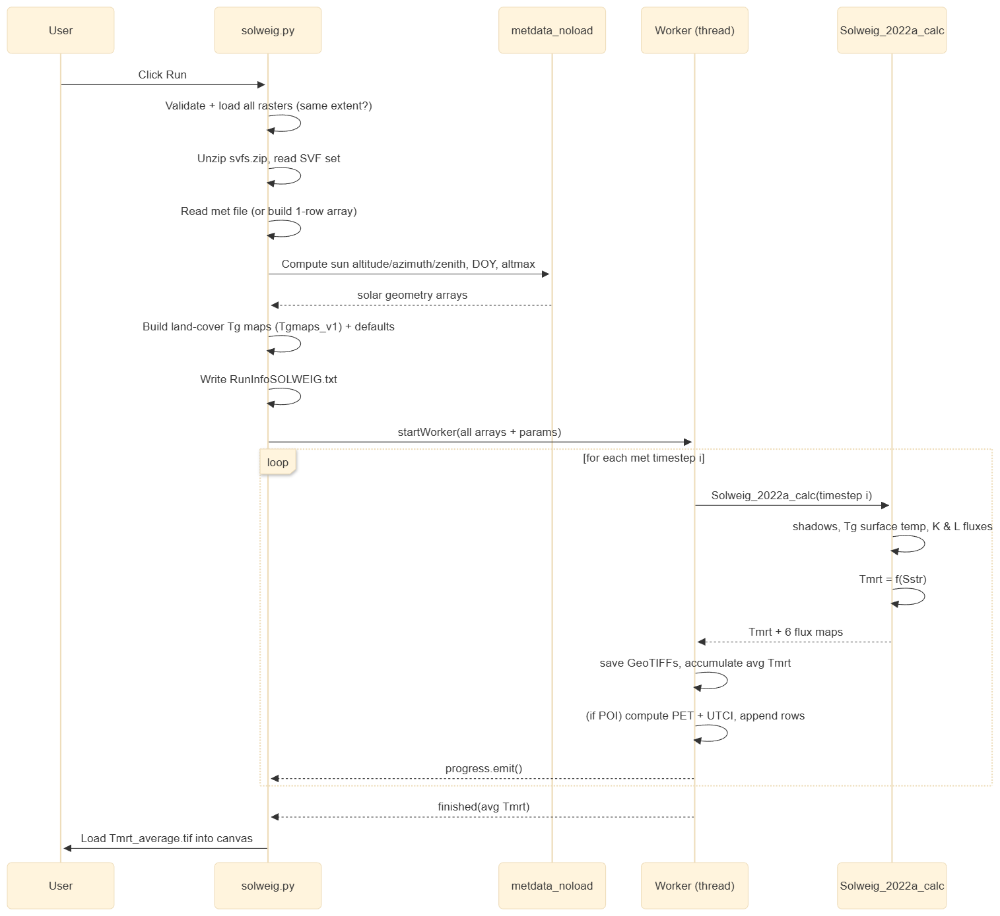


### 2.6.3 Per-timestep physics (inside the core calc)

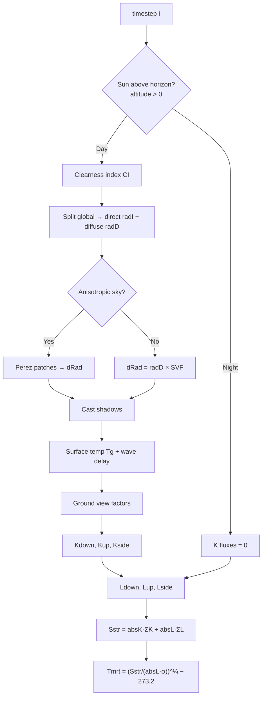

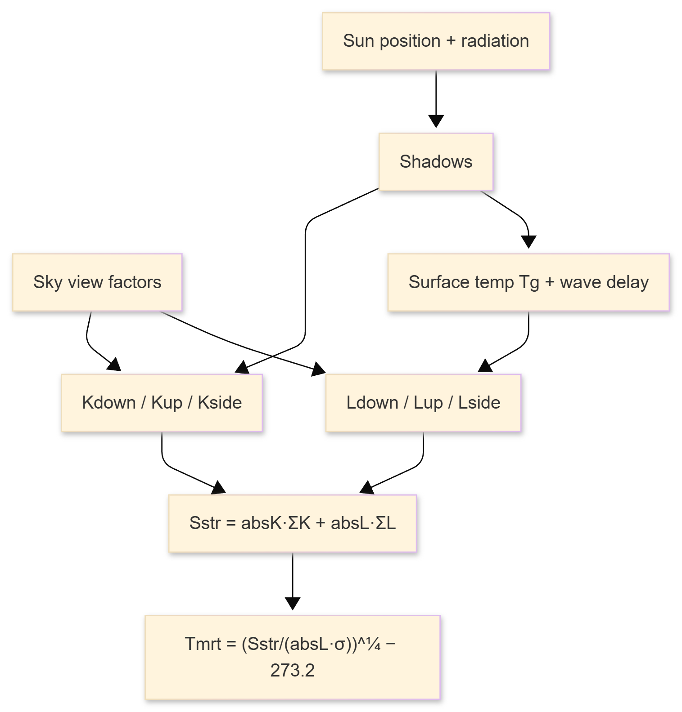


**Day/night branch:** at night all shortwave fluxes are zero (longwave only); during day full shadow + clearness + K+L budgets run, then Tmrt is derived from `Sstr` using the body-model combination (cube/cylinder × isotropic/anisotropic).

### 2.6.4 Runtime steps (narrative)

1. **Load (QGIS startup).** QGIS reads `metadata.txt`, calls `classFactory` in `__init__.py` → builds `UMEP`; `UMEP.py` adds the menu item.
2. **Open dialog.** Menu → `SO()` → `SOLWEIG(iface).run()` → modal dialog with `.ui` defaults.
3. **Collect & validate inputs** (`start_progress`): read DSM → `scale = 1/pixel-size`, lat/lon (corner reprojected to WGS84), altitude = median(DSM) (else 3 m); NoData handling; optional CDSM/TDSM/LC/DEM/walls; **extent/resolution check** vs DSM; unzip `svfs.zip` (+ `shadowmats.npz` if anisotropic, patch count 145/153/306/612).
4. **Met & solar geometry.** Parse 24-col file (or 1-row GUI array); `Solweig_2015a_metdata_noload` → sun position, DOY, daily max altitude.
5. **Surface-temp maps.** LC on → `Tgmaps_v1`; else uniform defaults.
6. **Logging.** `WriteMetadataSOLWEIG.writeRunInfo` → settings file.
7. **Threaded time loop** (`solweigworker.py`): per timestep → core calc, save rasters, accumulate avg Tmrt, (POIs) PET + UTCI.
8. **Finish.** Save avg Tmrt, style + load to canvas, success dialog.

### 2.6.5 How SOLWEIG is added to UMEP/QGIS

UMEP is an umbrella plugin; `UMEP.py` registers SOLWEIG as a menu action wired to a callback:

```68:68:UMEP.py
from .SOLWEIG.solweig import SOLWEIG
```

```285:289:UMEP.py
        self.MRT_Action = QAction(
            "Mean Radiant Temperature (SOLWEIG)", self.iface.mainWindow()
        )
        self.OTC_Menu.addAction(self.MRT_Action)
        self.MRT_Action.triggered.connect(self.SO)
```

```753:755:UMEP.py
    def SO(self):
        sg = SOLWEIG(self.iface)
        sg.run()
```

**Minimal QGIS plugin contract** (what we will reuse): a folder under QGIS `python/plugins/` with —

1. `metadata.txt` (manifest: `name`, `qgisMinimumVersion`, `description`, `version`, `author`, `email`, `about`).
2. `__init__.py` with `def classFactory(iface): from .MyPlugin import MyPlugin; return MyPlugin(iface)`.
3. A plugin class with `initGui(self)` (add menu/toolbar), `unload(self)` (remove), and `run(self)` (open dialog).

**Reusable recipe (SOLWEIG technique → reuse)**


| Concern              | Technique                                                                                        |
| -------------------- | ------------------------------------------------------------------------------------------------ |
| Register with QGIS   | `metadata.txt` + `classFactory`                                                                  |
| UI                   | `.ui` in Qt Designer, `uic.loadUiType`                                                           |
| Pick layers          | `QgsMapLayerComboBox` + `QgsMapLayerProxyModel.Filter.RasterLayer`/`PointLayer`                  |
| Read raster → numpy  | `gdal.Open(path).ReadAsArray().astype(float)`                                                    |
| Geo info             | `GetGeoTransform()` for scale; `osr` reproject corner for lat/lon                                |
| Validate             | equal extent/resolution; NoData; `QMessageBox` errors                                            |
| Long computation     | `QThread` `Worker(QObject)` + `finished`/`error`/`progress` signals                              |
| Progress             | `progress.emit()` → `progressBar.setValue`                                                       |
| Write raster         | `gdal.GetDriverByName('GTiff').Create(...)` + `WriteArray` + `SetGeoTransform` + `SetProjection` |
| Reproducibility      | write a `RunInfo.txt` of all parameters                                                          |
| Defaults & constants | tunables in `.ui`; per-class properties in a lookup table file                                   |


## 2.7 Deliverables

- This self-contained document, now including:
  - Detailed input spec (raster table + full 24-column met map + `svfs.zip` contents) — §2.3.
  - Detailed output spec (raster table + 35-column POI dictionary) — §2.4.
  - Input → output influence matrix — §2.4.3.
  - Parameter & default-value tables (GUI, hard-coded, land cover) — §2.5.
  - Architecture diagrams (hierarchy, data flow, execution, physics) — §1.3 / §2.6.
  - Plugin packaging "recipe" and minimal skeleton — §2.6.5 / Week 5.

## 2.8 Challenges / notes

- Met-file column *names* for the unused columns were inferred from the standard UMEP/SUEWS forcing format; the 11 columns SOLWEIG actually reads are confirmed from code.
- Detailed flux math (`gvf_2018a`, `Kside/Lside_v2022a`) intentionally deferred to Week 3.

## 2.9 Plan for Week 3

- Trace the 6-direction flux assembly (`gvf_2018a`, `Kside_veg_v2022a`, `Lside_veg_v2022a`, `Lcyl_v2022a`).
- Document the shadow-casting and Perez anisotropic-sky algorithms.
- Begin preparing a sample dataset for an end-to-end run (Week 4).

---

# Week 3 — Deep Dive: Radiation Physics (planned)

**Theme:** Understand the 6-direction shortwave (K) and longwave (L) flux assembly that builds `Tmrt`.

## 3.1 Goals

- Trace how each directional flux is computed and combined into `Sstr` → `Tmrt`.
- Understand shadow casting and the Perez anisotropic-sky option.

## 3.2 Planned tasks

- Read `gvf_2018a.py` — ground view factors (how surrounding ground/walls radiate onto a pixel, per direction).
- Read `Kup_veg_2015a.py`, `Kside_veg_v2022a.py` — upward & side shortwave.
- Read `Lside_veg_v2022a.py`, `Lcyl_v2022a.py` — side & cylinder longwave.
- Read `shadowingfunction_wallheight_13/23.py` — building & vegetation shadows.
- Read `Perez_v3.py` + `create_patches.py` — anisotropic sky patches.
- Read `cylindric_wedge.py`, `TsWaveDelay_2015a.py` — wall-shadow fraction & surface-temp inertia.

## 3.3 Focus diagram (to be annotated with equations)

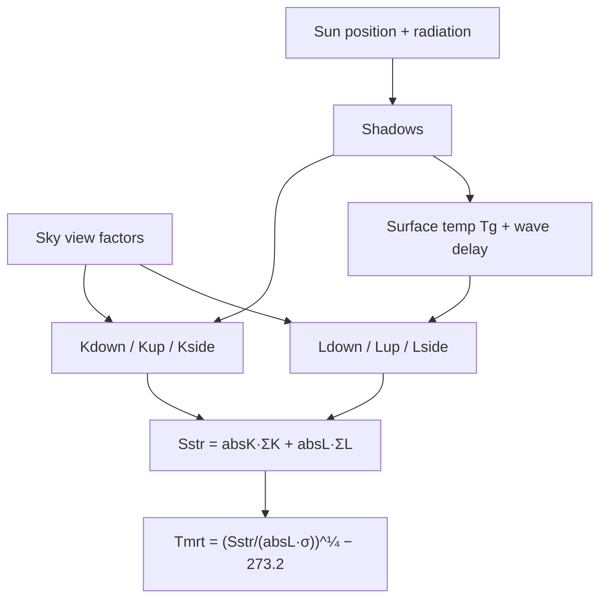


## 3.4 Expected deliverables

- Annotated flux-assembly notes (per-direction K and L equations).
- Short write-up: isotropic vs anisotropic (Perez) sky — when and why it matters.

## 3.5 Risks / notes

- The math is dense and references several papers (Perez 1993, Martin & Berdahl 1984, Reindl 1990). Will cite rather than re-derive.

## 3.6 Plan for Week 4

- Assemble a small sample dataset and run SOLWEIG end-to-end.

---

# Week 4 — Hands-on Run & Output Interpretation (planned)

**Theme:** Run SOLWEIG on real inputs and learn to read the outputs.

## 4.1 Goals

- Produce the full input set with UMEP pre-processors and run SOLWEIG.
- Interpret the Tmrt map and a POI PET/UTCI time-series.

## 4.2 Planned tasks

- Generate inputs: DSM, CDSM, Wall Height/Aspect, SVF (`svfs.zip`), land cover, met file.
- Run a single-timestep case, then a multi-timestep (diurnal) case.
- Load `Tmrt_average.tif` (styled via `tmrt.qml`); inspect a `POI_<name>.txt`.
- Verify the `RunInfoSOLWEIG_*.txt` against chosen settings.

## 4.3 Pipeline being exercised

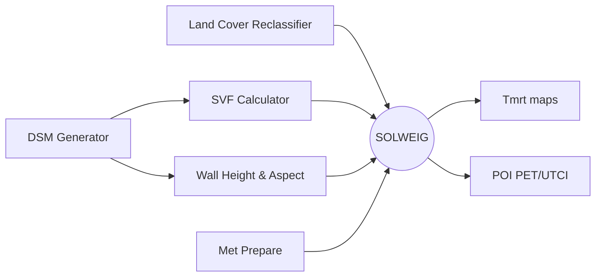

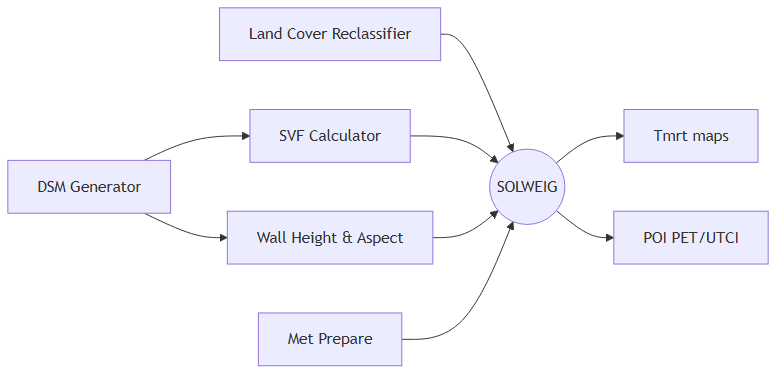


## 4.4 Expected deliverables

- Screenshot of a Tmrt map + a plotted POI Tmrt/PET/UTCI series.
- A checklist "how to run SOLWEIG from scratch" (inputs → settings → outputs).

## 4.5 Risks / notes

- Input rasters must share identical extent/resolution — most likely source of run failures.

## 4.6 Plan for Week 5

- Stand up a minimal QGIS plugin skeleton.

---

# Week 5 — QGIS Plugin Skeleton ("hello world") ✅

**Theme:** Reproduce the minimal QGIS plugin contract that SOLWEIG follows.
**Environment:** QGIS **4.0.3-Norrköping** (plugins folder: `QGIS4`, not `QGIS3`).

## 5.1 Goals

- Build a loadable plugin that registers a menu item and opens a dialog.

## 5.2 Tasks completed

- Created plugin folder `hello_qgis_plugin/` with `metadata.txt`, `__init__.py`, `hello_plugin.py`.
- Implemented `classFactory`, `initGui`, `unload`, `run` (same contract as SOLWEIG).
- Built a simple dialog in code (SOLWEIG uses a `.ui` file — that comes in a later week).
- Installed to QGIS 4 profile:  
  `C:\Users\spagadala1\AppData\Roaming\QGIS\QGIS4\profiles\default\python\plugins\hello_qgis_plugin\`
- Tested in QGIS 4.0.3 on project **Solweig_latest** — plugin loads, menu works, "Count layers" returns **21 layers**.

## 5.3 Plugin structure (built)

```
hello_qgis_plugin/
├── metadata.txt          # manifest (qgisMin 3.0, qgisMax 4.99)
├── __init__.py           # classFactory(iface) -> HelloPlugin(iface)
└── hello_plugin.py       # initGui / unload / run + HelloDialog
```

**Mapping to SOLWEIG**

| Our file | SOLWEIG equivalent |
|----------|-------------------|
| `metadata.txt` | UMEP root `metadata.txt` |
| `__init__.py` → `classFactory` | UMEP root `__init__.py` |
| `hello_plugin.py` → `HelloPlugin` | `SOLWEIG/solweig.py` → `SOLWEIG` class |
| `HelloDialog` (in code) | `solweig_dialog.py` + `solweig_dialog_base.ui` |
| `initGui` / menu action | registered via `UMEP.py` → `MRT_Action` for SOLWEIG |

## 5.4 Deliverables & screenshots

Saved under **`images/week5_qgis_plugin/`**

| # | File | What it shows |
|---|------|---------------|
| 1 | `01_plugin_installed_manager.png` | Plugin enabled in *Manage and Install Plugins → Installed* |
| 2 | `02_plugins_menu_hello_qgis.jpg` | **Plugins → Hello QGIS → Hello QGIS...** in QGIS 4.0.3 |
| 3 | `03_dialog_count_layers_working.jpg` | Dialog + layer-count result on Solweig_latest project |
| 4 | `04_layer_count_messagebox.png` | API test: "There are 21 layer(s) loaded in this project." |
| 5 | `05_hello_dialog_main.png` | Main Hello QGIS dialog |

**Figure 5.1** — Plugin enabled in QGIS Plugin Manager


**Figure 5.2** — Menu entry: Plugins → Hello QGIS

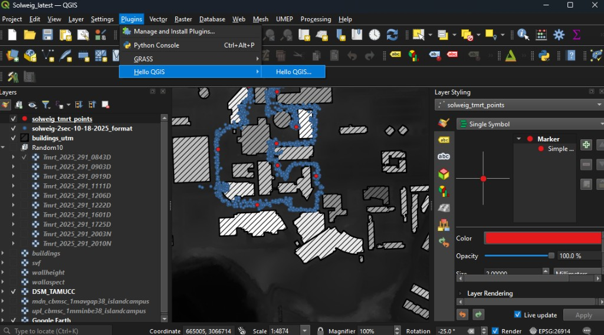

**Figure 5.3** — Dialog running on Solweig_latest; layer count = 21

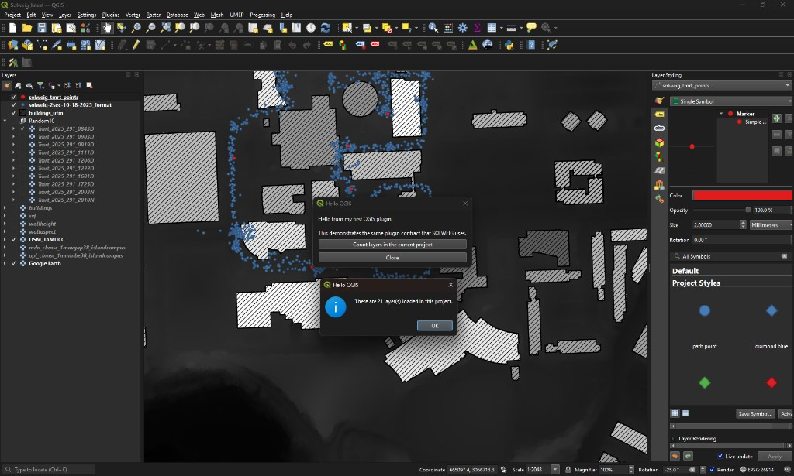

**Figure 5.4** — QgsProject API: layer count message box

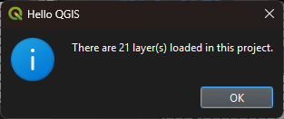

**Figure 5.5** — Main Hello QGIS dialog (Week 5)

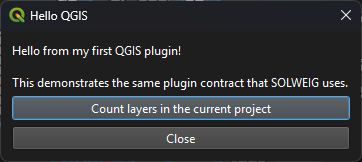

## 5.5 Notes / lessons learned

- Multiple QGIS versions use **separate profile folders**: QGIS 3 → `...\QGIS\QGIS3\...`, QGIS 4 → `...\QGIS\QGIS4\...`. Plugin must be copied to the folder matching the version you run.
- Mark plugin as `experimental=True` in `metadata.txt` and enable *Show experimental plugins* in the plugin manager.
- Source (editable): `d:\San\GA_SUMMER_2026\hello_qgis_plugin\`

## 5.6 Plan for Week 6

- Add raster layer picker + GDAL read into NumPy (SOLWEIG pattern from `solweig.py`).

---

# Week 6 — Own Plugin: Input Handling, UI & Layer Selection ✅

**Theme:** Make the skeleton consume GIS data, reusing SOLWEIG's patterns.
**Plugin version:** 0.2

## 6.1 Goals

- Add raster/point layer pickers, read a raster into NumPy, and validate it.

## 6.2 Tasks completed

- Added **3 layer pickers** via `QgsMapLayerComboBox`:
  - Primary raster (DSM-like) — `RasterLayer` filter
  - Second raster (optional) — for extent/resolution match check
  - Point layer (optional) — `PointLayer` filter (POI pattern from SOLWEIG)
- Implemented **`read_raster_summary()`** — same steps as `solweig.py` DSM load:
  - `gdal.Open(uri).ReadAsArray().astype(float)`
  - `GetGeoTransform()` → pixel size → `scale = 1/pixel_size`
  - NoData → 0; negative values raised (SOLWEIG issue #85 pattern)
  - `osr` reprojection → corner **lat/lon** (GDAL 3.x swap handled)
- Implemented **`rasters_match()`** — shape + pixel-size check (SOLWEIG aborts if grids differ)
- Added **parameter spinboxes** with SOLWEIG defaults: `absK=0.70`, `absL=0.95`, `albedo=0.20`
- **Summary panel** (`QTextEdit`) shows full read/validate output for screenshots

## 6.3 Code added (key functions)

| Function | SOLWEIG equivalent | What it does |
|----------|-------------------|--------------|
| `read_raster_summary(layer)` | `start_progress` DSM block in `solweig.py` | GDAL → NumPy + geo metadata |
| `rasters_match(a, b)` | extent/resolution checks in `solweig.py` | shape + pixel size compare |
| `_corner_lat_lon(ds, layer)` | lines 397–434 in `solweig.py` | WGS84 lat/lon from corner |
| `HelloDialog.read_and_validate()` | `start_progress()` validation flow | UI → read → validate → summary |

## 6.4 Hands-on test (QGIS 4.0.3 — Solweig_latest project)

Tested on the campus SOLWEIG project with real UMEP-derived layers.

**Layers selected**

| Picker | Layer chosen | Purpose |
|--------|--------------|---------|
| Primary raster | `buildings` | DSM-like grid (building mask raster) |
| Second raster | `buildings` | Match-check (same grid) |
| Point layer | `solweig_tmrt_points` | POI pattern (10 features) |

**Parameters used:** absK = 0.70, absL = 0.95, wall albedo = 0.20 (SOLWEIG defaults)

**Read & validate — results from summary panel**

| Field | Value |
|-------|-------|
| URI | `D:/San/Heatwave/.../Results/2022a/buildings.tif` |
| CRS | EPSG:26914 (NAD83 / UTM zone 14N) |
| Shape | **1346 rows × 1445 cols** |
| Pixel size | 1.0000 m → scale = 1.0000 |
| Value range | 0.00 .. 1.00 (median / alt = 1.00 m) |
| NoData | -9999.0 → replaced with 0; raised by 0.00 m |
| Corner lat/lon (WGS84) | **27.70661, -97.33157** |
| Second raster match | **Extent and resolution match.** ✅ |
| Point layer | `solweig_tmrt_points` — **10 features** |

Success dialog confirmed: *"Primary raster loaded. Rows: 1346 Cols: 1445"*

This proves the plugin can:
1. Pick layers from the QGIS project (same as SOLWEIG's `QgsMapLayerComboBox`).
2. Read raster to NumPy via GDAL (same as `solweig.py` DSM block).
3. Derive scale, altitude, lat/lon, and handle NoData.
4. Validate that two rasters share extent/resolution (SOLWEIG's hard rule before run).
5. Echo parameters that would feed a model run.

## 6.5 Screenshots & deliverables

Saved under **`images/week6_input_handling/`**

| # | File | What it shows |
|---|------|---------------|
| 1 | `01_dialog_read_validate_summary.png` | Full Week 6 dialog + summary panel with all metadata |
| 2 | `02_success_raster_loaded.png` | Success confirmation (1346 × 1445 loaded) |

**Figure 6.1** — Week 6 dialog: layer pickers, parameters, and full summary after Read & validate  
(buildings raster 1346×1445, EPSG:26914, match OK, 10 POI features)

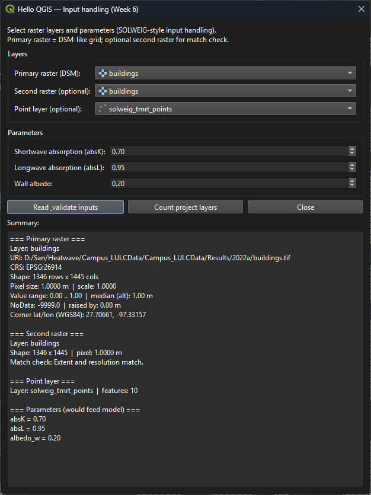

**Figure 6.2** — Success dialog: primary raster loaded (1346 rows × 1445 cols)

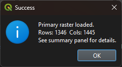

**Week 6 deliverables (submission checklist)**

- [x] Raster layer picker (`QgsMapLayerComboBox` + `RasterLayer` filter)
- [x] Optional second raster for extent/resolution validation
- [x] Optional point layer picker (`PointLayer` filter)
- [x] GDAL read → NumPy with geo metadata (scale, lat/lon, NoData)
- [x] Parameter spinboxes (absK, absL, albedo) with SOLWEIG defaults
- [x] Summary panel + success/error dialogs
- [x] Tested on real Solweig_latest project data
- [x] Screenshots saved under `images/week6_input_handling/`

## 6.6 What we learned (vs SOLWEIG)

| SOLWEIG (`solweig.py`) | Our plugin (Week 6) |
|------------------------|---------------------|
| 8+ raster combo boxes (DSM, CDSM, DEM, LC, walls, SVF zip…) | 2 raster + 1 point combo (minimal proof) |
| Validation aborts entire run on mismatch | Warning dialog + summary still shown |
| Parameters in `.ui` file | Parameters in code (spinboxes); `.ui` deferred |
| Reads all inputs then starts `Worker` thread | Read only — **no computation yet** (Week 7) |

## 6.7 Source & install paths

- **Source:** `d:\San\GA_SUMMER_2026\hello_qgis_plugin\` (v0.2)
- **Installed:** `C:\Users\spagadala1\AppData\Roaming\QGIS\QGIS4\profiles\default\python\plugins\hello_qgis_plugin\`

## 6.8 Next week changes (Week 7)

**Theme:** move from input-validation prototype to first real model output.

### 6.8.1 Code changes planned

- Add a `Worker(QObject)` class running in `QThread` (SOLWEIG-like pattern).
- Add progress updates (`progress.emit(%)`) and connect to a dialog progress bar.
- Add cancel/stop handling so long operations can be interrupted safely.
- Compute a first output raster from selected input(s) (baseline: copy/transform primary raster as proof of write path).
- Write output using GDAL to a GeoTIFF in a chosen output folder.
- Auto-load written GeoTIFF back into QGIS project on success.

### 6.8.2 UI changes planned

- Add output folder picker (`QFileDialog.getExistingDirectory`).
- Add `Run` / `Cancel` buttons and disable controls during execution.
- Keep summary panel updated with run status, output path, and elapsed time.

### 6.8.3 Validation updates planned

- Require primary raster before run.
- Check writable output folder before starting thread.
- Keep extent/resolution check for second raster; block run if mismatch.

### 6.8.4 Deliverables for Week 7

- Updated plugin version (v0.3) with threaded execution.
- One generated GeoTIFF loaded in QGIS.
- Screenshot set: running progress, successful output write, output layer loaded.
- Short test log for one success case and one validation failure case.

### 6.8.5 Implementation sequence (day-by-day)

| Day | Focus | Expected output |
|-----|-------|-----------------|
| Day 1 | Add `Worker(QObject)` + `QThread` wiring | Run button starts background worker without freezing UI |
| Day 2 | Add progress + cancel signals | Progress bar updates; cancel stops run cleanly |
| Day 3 | Add GeoTIFF write function (GDAL) | Output file created in selected folder |
| Day 4 | Add auto-load into QGIS + messages | New output layer appears in Layers panel |
| Day 5 | Regression checks + screenshots + notes | Submission-ready evidence pack |

### 6.8.6 Test matrix (Week 7)

| Test case | Input setup | Expected result |
|-----------|-------------|-----------------|
| Happy path | Primary raster + valid output folder | GeoTIFF written and auto-loaded |
| Missing primary raster | No raster selected | Validation message; run blocked |
| Unwritable folder | Read-only or invalid folder | Error dialog; no crash |
| Cancel run | Start run then click Cancel | Worker stops; UI re-enabled |
| Raster mismatch | Primary + mismatched second raster | Validation message; run blocked |

### 6.8.7 Acceptance criteria

- UI remains responsive while computation runs.
- Progress reaches 100% on successful run.
- Output GeoTIFF opens correctly in QGIS with expected extent/resolution.
- All error paths show clear dialogs and do not crash plugin/QGIS.
- Week 7 screenshots and mini test log are attached to report.

### 6.8.8 Risks and mitigation

| Risk | Impact | Mitigation |
|------|--------|------------|
| Thread signal miswiring | Run appears stuck | Keep start/finish/error signal map documented and tested |
| GDAL write errors | No output saved | Validate folder write permission before run; catch exceptions |
| QGIS UI state not restored on error | User confusion | Centralize cleanup method to re-enable controls on all exits |
| Scope creep into full SOLWEIG physics | Delays Week 7 | Keep Week 7 goal to "one valid GeoTIFF path" only |

### 6.8.9 Preview for Week 8

- Replace placeholder raster transform with first meaningful thermal computation block.
- Add configurable output naming and timestamped run folders.
- Start aligning plugin dialog with SOLWEIG `.ui` organization pattern.

## 6.9 Week 8 — First computation block (detailed plan)

**Theme:** move from "pipeline works" to "model logic starts."

### 6.9.1 Week 8 goals

- Implement the first meaningful thermal output computation on raster cells.
- Keep threaded run + progress + cancel stable from Week 7.
- Standardize output naming and run-folder structure for repeatable tests.
- Document assumptions clearly so later SOLWEIG parity steps are traceable.

### 6.9.2 Proposed computation scope (Week 8)

Use a simple, explicit baseline equation (not full SOLWEIG yet) to validate end-to-end physics wiring:

- `Tmrt_like = Ta + alpha * (Kdown / 100.0) - beta * Wind`
- Suggested starting defaults: `alpha = 0.7`, `beta = 0.25`
- Inputs:
  - `Kdown` proxy from selected raster (or derived normalized raster)
  - `Ta` and `Wind` from user controls (single-value parameters for now)

This keeps Week 8 focused on architecture and correctness, before importing full multi-flux SOLWEIG logic.

### 6.9.3 UI changes for Week 8

- Add numeric controls for `Ta`, `Wind`, `alpha`, `beta`.
- Add output naming options:
  - run prefix (text)
  - timestamp toggle
  - overwrite/append behavior
- Add small "Computation mode" label (Baseline v0.1) in summary panel.

### 6.9.4 File/output structure

| Output | Example |
|--------|---------|
| Run folder | `outputs/2026-07-xx_run01/` |
| Main raster | `tmrt_like.tif` |
| Optional debug rasters | `kdown_proxy.tif`, `intermediate_norm.tif` |
| Run metadata | `run_info_week8.txt` |

### 6.9.5 Validation and safety checks

- Reject NaN/inf parameter values.
- Clip computed raster to a reasonable range (for Week 8 sanity), e.g. `[-30, 80]`.
- Preserve input NoData mask in outputs.
- Confirm CRS/geotransform of output matches primary raster exactly.

### 6.9.6 Test plan (Week 8)

| Test | Method | Pass condition |
|------|--------|----------------|
| Deterministic rerun | Same inputs twice | Identical output stats/min/max |
| Parameter sensitivity | Increase `Ta` by +5 | Output mean increases by ~5 |
| Wind effect | Increase `Wind` | Output mean decreases |
| NoData handling | Raster with NoData edges | NoData retained in output |
| Thread robustness | Run + cancel + rerun | No hangs/crashes; controls restored |

### 6.9.7 Deliverables for Week 8

- Plugin v0.4 with baseline computation mode.
- At least one valid `tmrt_like.tif` generated and loaded in QGIS.
- Screenshot set:
  - computation settings panel
  - successful run summary
  - output layer loaded on map
- Short result summary table (min, max, mean, std) for one test run.

### 6.9.8 Week 8 completion checklist

- [ ] Baseline formula implemented in worker thread.
- [ ] Output naming + run folder system implemented.
- [ ] Metadata text file written for each run.
- [ ] 5 test cases executed and logged.
- [ ] Screenshots captured and added under `images/week8_first_computation/`.

---

# Week 9 — Real Sun-Position-Driven Kdown

**Theme:** Replace the Week 8 placeholder computation with a real, sun-position-driven Kdown, fixing the finding that Week 8's output never changed with input time or date.

## 9.1 Motivation: the Week 8 finding

Code review of the Week 8 baseline found that `tmrt_like = Ta + alpha*(kdown_proxy/100) - beta*Wind` was a pure affine (linear, monotonic) transform of whatever raster was chosen as the "primary raster" — `kdown_proxy` was just a min/max rescale of the input, with no dependency on sun position, time of day, or radiation geometry. A run at noon and a run at midnight produced byte-identical output. This was intentional for Week 8 (the goal was proving the Worker/QThread/GeoTIFF pipeline, not physical correctness), but it meant the output carried zero physical meaning.

## 9.2 What was built

- **`compute_week9.py`** — a new, QGIS-free pure-Python module with 8 functions, all unit-tested with pytest (16 tests, no QGIS session required):
  - `daynight_flag(sun_altitude_deg)` — day/night classification matching SOLWEIG's own `altitude <= 0` convention
  - `compute_kdown(svf_array, sun_altitude_deg, radG)` — isotropic-sky incoming shortwave: `radG * SVF` by day, zero at night
  - `compute_tmrt_like(kdown, ta, wind, alpha, beta)` — the Week 8/9 shared placeholder formula, now fed a real `Kdown`
  - `build_time_dict` / `build_location_dict` — construct the exact dict shapes UMEP's own `sun_position()` expects
  - `sun_altitude_from_zenith` / `resolve_sun_altitude` — zenith-to-altitude conversion, with dependency-injected sun-position function for testability
  - `clear_sky_radG` (optional stretch goal, completed) — a placeholder clear-sky radiation estimate, not currently wired into the Worker
- **`locate_umep_sun_position()`** in `hello_plugin.py` — locates and imports UMEP's own real `sun_position()` from the installed UMEP plugin directory (via `QgsApplication.qgisSettingsDirPath()`), reusing UMEP's validated solar-geometry algorithm rather than reimplementing it. Raises a clear, actionable `ImportError` if UMEP isn't installed — no silent fallback.
- **New GUI controls**: a required SVF raster picker, plus a "Sun position (Week 9)" group with Year/Month/Day/Hour/Minute/UTC-offset/radG spinboxes (defaulting to today's date, noon, UTC+1, radG=895 W/m² — SOLWEIG's own manual-mode default).
- **`Worker.run()` rewritten**: opens both the primary (DSM) raster and the new SVF raster, derives lat/lon/altitude from the DSM corner (same logic as Week 6), calls the real `sun_position()` to get sun altitude/azimuth, computes `Kdown = radG * SVF` (zeroed at night), then `Tmrt_like` from the shared formula. Output filename now carries a `D`/`N` suffix (`tmrt_like_D.tif` / `tmrt_like_N.tif`) matching real SOLWEIG's day/night naming convention. `run_info_week9.txt` logs date/time, UTC offset, lat/lon, computed sun altitude/azimuth, radG, and output stats.
- **Validation**: SVF raster is now required and grid-matched against the primary raster (same `rasters_match()` check used for the optional secondary raster) before the run is allowed to start.

## 9.3 Code review findings (fixed before merge)

Subagent-driven code review caught two real issues before this shipped:
- **Lat/lon swap** — the new sun-position code initially assigned `lat, lon = lonlat[1], lonlat[0]`, backwards from the pre-existing, correct `_corner_lat_lon()` helper's `lon, lat = lonlat[1], lonlat[0]`. This would have silently fed swapped coordinates into the sun-position calculation, producing plausible-looking but geographically wrong sun angles with no error raised. Fixed to match the existing helper exactly.
- **Missing SVF/primary grid-match check** — the SVF raster was required but never validated against the primary raster's extent/resolution before Task 8's initial implementation, unlike the existing optional secondary-raster check. Fixed by adding the same `rasters_match()` validation, blocking the run on mismatch.

## 9.4 Test matrix (to be completed manually in QGIS)

| Test | Method | Pass condition | Result |
|---|---|---|---|
| Day/night differ | Run same inputs at noon vs. midnight | Noon shows SVF-weighted gradient; midnight is flat (`Ta - beta*Wind`); filename suffix D vs N | *pending* |
| radG sensitivity | Increase radG | Daytime output mean increases proportionally | *pending* |
| SVF gradient | Visual check | Output follows `svf`'s continuous gradient, not a binary stencil | *pending* |
| Missing SVF | Run without selecting SVF raster | Validation error, run blocked | *pending* |
| SVF/DSM mismatch | Mismatched grids | Validation error, run blocked | *pending* |

## 9.5 Deliverables

- `hello_qgis_plugin` v0.5
- `compute_week9.py` with 16 passing unit tests (`pytest tests/ -v`)
- `run_info_week9.txt` per run
- Screenshots and completed test matrix: *pending manual QGIS verification*

---

## Cumulative status (Weeks 1–9)


| Objective                                      | Status                                                       |
| ---------------------------------------------- | ------------------------------------------------------------ |
| 1. How SOLWEIG works (overview + architecture) | ✅ Complete (W1–2)                                            |
| 2. Parameter → output mapping                  | ✅ Complete (W2)                                              |
| 3. Execution sequence & defaults               | ✅ Complete (W2)                                              |
| 4. Architecture diagrams                       | ✅ Complete (hierarchy, data flow, execution, physics, I/O)   |
| 5. UMEP/QGIS integration & plugin recipe       | ✅ Complete (W2)                                              |
| 6. Build our own plugin                        | 🔄 In progress — W5–6 done; W7 threading/output done; W8 baseline computation done; W9 real sun-position Kdown done (pending manual QGIS verification) |


**Phase overview**


| Phase                        | Weeks | Focus                                                       |
| ---------------------------- | ----- | ----------------------------------------------------------- |
| Analysis & documentation     | 1–2   | ✅ How SOLWEIG works, I/O, defaults, diagrams, integration   |
| Physics deep dive & hands-on | 3–4   | 🗓 Flux assembly, run on sample data, output interpretation |
| Plugin foundation            | 5–6   | ✅ Layer pickers, GDAL read, validation, parameters        |
| Plugin build-out             | 7–8   | ✅ Detailed execution plans for threading, output, baseline computation |
| Plugin build-out (implementation) | 9–12  | ⏳ Week 9 (real sun-position Kdown) done; Weeks 10-12 (shadow casting, met-file loop, packaging, docs) not yet started |


**Overall:** On track. Conceptual analysis and documentation (Objectives 1–5) are complete through Week 2; Weeks 3–6 are planned in detail above, with build-out continuing through Week 12.